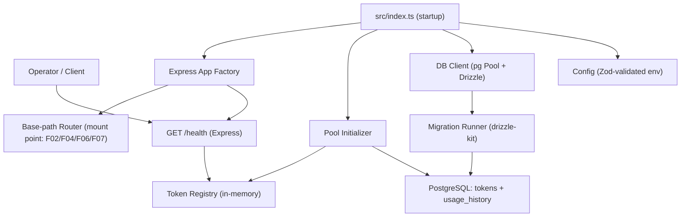

# Technical Spec: F01. Service Foundation and Token Pool Initialization

## 1. Technical Overview

**What:** Bootstrap a standalone Node.js (TypeScript) HTTP/JSON service that seeds and owns a fixed pool of exactly 100 pre-generated UUID tokens, exposes a `GET /health` endpoint, and initializes both the in-memory active-state registry and the durable PostgreSQL history store before accepting any traffic. This feature produces the scaffolding — Express app, typed configuration, database client and migrations, the token registry, and the startup orchestration — that every other feature (F02, F04, F05, F06, F07) consumes.

**Why:** The whole product depends on a single authority that guarantees the 100-token invariant. That invariant can only hold if the pool is created once, its identity set is stable across restarts, and the service refuses to serve traffic in a degraded state. Centralizing service bootstrap, config, persistence wiring, and the registry here keeps the invariant enforceable from a single place and gives later features a ready pool, a durable store, and consistent HTTP/error conventions to build on.

**Scope:**

**Included:**
- Node.js + TypeScript service scaffold using Express, with all business routes mounted under a single configurable base path and a `GET /health` endpoint mounted at the root.
- Typed, Zod-validated configuration module reading environment variables with defaults: pool size (100), token TTL (120s), HTTP port, base path, and `DATABASE_URL`.
- PostgreSQL persistence wired via Drizzle ORM + drizzle-kit: schema definitions and migrations for the `tokens` (durable pool identity) and `usage_history` (durable audit) tables. The durable store is initialized (connected + migrated) before traffic is accepted.
- Seed-or-load of exactly 100 unique UUID (v4) tokens: seed on first boot, reload the same identity set on subsequent boots (from PRD *Provides*: the token registry used by F02, F04, F06, F07).
- In-memory active-state registry initialized to all-available (active state is process-local per PRD *Out of Scope*).
- `GET /health` returning `{ status, available, active }` where `available + active` always equals the pool size.
- Fail-fast startup: abort (never serve traffic) on invalid config, unreachable DB / failed migration, an inconsistent persisted pool, an unavailable HTTP port, or inability to produce a unique token set.
- Shared HTTP conventions: JSON body parsing, a central error-handling middleware with a standard error envelope, and a not-found handler — the pattern F02+ reuse.

**Excluded (owned by other features / PRD Out of Scope):**
- Token assignment, overflow eviction, and atomic concurrency handling (F02).
- Automatic TTL release / background sweeper (F03).
- Pool/token listing (F04), history query semantics (F05), token detail (F06), clear-active (F07). This feature creates the `usage_history` schema but does not populate or query it.
- Authentication, authorization, rate limiting, multi-instance/shared pool, per-tenant pools, and any UI (all PRD Out of Scope).

**Decisions / Assumptions (interview + bootstrap):**
- Stack chosen during greenfield bootstrap interview: TypeScript, Express, PostgreSQL, Drizzle ORM + drizzle-kit, Vitest, Zod, env-var config module. Recorded here so subsequent features read these from the codebase.
- The 100 token UUIDs are **persisted** in a `tokens` table and reloaded on every boot so `usage_history` (F05) and token detail (F06) stay queryable by a stable token UUID across restarts. (PRD *Experience* says the service "generates **or** loads" — this spec resolves that ambiguity toward load.)
- Active state (which tokens are active, holder, `activatedAt`) lives only in the in-memory registry (PRD *Out of Scope*: single in-memory registry, single instance). On every boot the registry starts empty → all tokens available.
- **Startup reconciliation:** because active state is process-local, any `usage_history` row left open (`released_at IS NULL`) by a previous crash/restart is closed at startup with `released_at = now()` and `release_reason = 'startup_reconciliation'`, so history never has dangling open entries. (Foundation choice not spelled out in the PRD; F05 may later refine reporting of these.)
- `POOL_SIZE` is read once at startup and treated as immutable for the process; there is no runtime path to change it (PRD *Error Handling*: pool immutable). If a persisted pool exists with a count different from the configured `POOL_SIZE`, startup aborts fatally rather than resizing.

## 2. Architecture Impact

**Affected components (all New — greenfield):**

| Area | Path | Role |
|------|------|------|
| Entrypoint | `src/index.ts` | Startup orchestration + server bootstrap |
| App factory | `src/app.ts` | Express app: JSON parsing, route mounting, error middleware |
| Config | `src/config/index.ts` | Typed, Zod-validated env config |
| DB schema | `src/db/schema.ts` | Drizzle definitions for `tokens`, `usage_history` |
| DB client | `src/db/client.ts` | pg Pool + Drizzle instance |
| Migrations runner | `src/db/migrate.ts` | Apply drizzle-kit migrations at startup |
| Registry | `src/registry/tokenRegistry.ts` | In-memory active-state registry (Provides to F02/F04/F06/F07) |
| Pool init | `src/services/poolInitializer.ts` | Seed-or-load 100 tokens; reconcile orphaned history |
| Health route | `src/routes/health.ts` | `GET /health` |
| Base router | `src/routes/index.ts` | Mount point under the base path for future features |
| Error handling | `src/middleware/errorHandler.ts`, `src/middleware/notFound.ts` | Standard JSON error envelope |
| Utilities | `src/lib/logger.ts`, `src/lib/errors.ts` | Logger + typed error classes/codes |

**Data flow:**



## 3. Technical Decisions

| Decision | Chosen Approach | Alternative Considered | Trade-off |
|----------|-----------------|------------------------|-----------|
| Durable history store | PostgreSQL via Drizzle ORM + drizzle-kit | SQLite (better-sqlite3); JSON file (lowdb) | Robust, queryable, standard migrations; accept an external dependency and coupling of startup to DB availability. |
| Active-state location | In-memory registry (process-local), seeded all-available on boot | DB-backed active state | Fast, in-process atomicity for F02; accept single-instance only and loss of active state on restart (all tokens return to available — expected per PRD). |
| Token identity lifecycle | Persist 100 UUIDs in `tokens`, seed once, reload each boot | Regenerate 100 fresh UUIDs every startup | Keeps F05 history and F06 detail coherent under a stable token UUID; accept a durable `tokens` table and a fixed identity set. |
| Startup posture | Fail-fast: abort on bad config, DB/migration failure, inconsistent pool, or port-in-use | Boot in a degraded/read-only mode | Guarantees "no traffic in a bad state" (PRD F01); accept that infra failures prevent boot entirely. |
| Orphaned open history on boot | Reconcile: close open `usage_history` rows with `release_reason = 'startup_reconciliation'` | Leave open rows as-is | History never carries dangling open entries after a crash; accept a synthetic release timestamp for interrupted sessions. |

## 4. Component Overview

**Backend:**

| File Path | New/Modified | Purpose | Key Responsibilities |
|-----------|--------------|---------|----------------------|
| `src/index.ts` | New | Startup orchestration | Load config → connect/migrate DB → seed/load pool → init registry → reconcile → listen; fail-fast + port-in-use handling; emit init log. |
| `src/app.ts` | New | Express app factory | Register JSON body parser, mount `/health` and base-path router, attach not-found + error middleware. |
| `src/config/index.ts` | New | Typed configuration | Parse/validate env with Zod; expose `POOL_SIZE`, `TOKEN_TTL_SECONDS`, `PORT`, `API_BASE_PATH`, `DATABASE_URL`; fail fast on invalid config. |
| `src/db/schema.ts` | New | Drizzle schema | Define `tokens` and `usage_history` tables/columns/indexes for the whole project. |
| `src/db/client.ts` | New | DB client | Create pg `Pool` from `DATABASE_URL`, wrap in Drizzle; expose a health/connectivity check. |
| `src/db/migrate.ts` | New | Migration runner | Apply generated migrations at startup; throw a store-identifying error on failure. |
| `src/registry/tokenRegistry.ts` | New | In-memory registry | Hold per-token active state; init all-available; expose counts (`available`, `active`) and the interface F02/F04/F06/F07 consume. |
| `src/services/poolInitializer.ts` | New | Pool bootstrap | Seed-or-load 100 unique tokens (transactional), abort on partial/inconsistent pool, retry on duplicate UUIDs; reconcile orphaned open history rows. |
| `src/routes/health.ts` | New | Health endpoint | `GET /health` → 200 with registry counts. |
| `src/routes/index.ts` | New | Base router | Router mounted at `API_BASE_PATH`; extension point for later features. |
| `src/middleware/errorHandler.ts` | New | Error middleware | Map thrown errors to the standard JSON error envelope + status. |
| `src/middleware/notFound.ts` | New | 404 handler | Return `NOT_FOUND` envelope for unmatched routes. |
| `src/lib/errors.ts` | New | Error types | `AppError` base + error-code constants reused across features. |
| `src/lib/logger.ts` | New | Logging | Minimal structured logger for startup/lifecycle logs. |
| `drizzle.config.ts` | New | drizzle-kit config | Point drizzle-kit at `schema.ts`, migrations dir, and `DATABASE_URL`. |

**Database:**

| Migration File | Tables Affected | Operation | Notes |
|----------------|-----------------|-----------|-------|
| `drizzle/0000_init.sql` | `tokens`, `usage_history` | CREATE | Durable pool identity + audit store; created before traffic is accepted. Populated/queried by F02/F05. |

## 5. API Contracts

Only one endpoint ships in F01. It also establishes the shared success/error envelope conventions used by all later features.

**Endpoint: Health Check**
- **Method:** GET
- **Path:** `/health` (mounted at root, outside `API_BASE_PATH`)
- **Authentication:** None (auth is PRD Out of Scope)

**Request:** No parameters, no body.

**Response (Success — 200):**

| Field | Type | Description |
|-------|------|-------------|
| `status` | `string` | Always `"ok"` once the service is initialized. |
| `available` | `integer` | Count of tokens currently in the available state. |
| `active` | `integer` | Count of tokens currently active. Always `available + active == POOL_SIZE`. |

**Response Example:**
```json
{
  "status": "ok",
  "available": 100,
  "active": 0
}
```

**Standard Error Envelope (established here, reused by F02+):**
```json
{
  "status": "error",
  "error": {
    "code": "NOT_FOUND",
    "message": "Route not found"
  }
}
```

**Error Codes (app-level, defined by F01 scaffolding):**

| Code | HTTP Status | Description |
|------|-------------|-------------|
| `NOT_FOUND` | 404 | Unmatched route (not-found middleware). Also the shape F05/F06 reuse for unknown token UUIDs. |
| `INTERNAL_ERROR` | 500 | Unhandled server error mapped by the central error middleware. |
| `VALIDATION_ERROR` | 400 | Reserved envelope for request validation failures; first used by F02. |

> Note: The service never serves `/health` in a degraded state. If startup fails (bad config, DB/migration failure, inconsistent pool, port in use), the process aborts before listening, so there is no 503 path — `/health` returning 200 is itself the readiness signal.

## 6. Data Model

**Table: `tokens`** — the durable, fixed pool identity set (PRD *Provides*: token registry).

| Column | Type | Nullable | Default | Description |
|--------|------|----------|---------|-------------|
| `id` | `uuid` | No | — (app-generated v4) | Token UUID; the stable pool identity, generated once at seed time. |
| `created_at` | `timestamptz` | No | `now()` | When the token identity was seeded. |

**Indexes:**

| Index Name | Columns | Type | Purpose |
|------------|---------|------|---------|
| `pk_tokens` | `id` | btree (PK) | Primary key / uniqueness of token UUIDs. |

**Constraints:**

| Constraint | Type | Definition | Purpose |
|------------|------|------------|---------|
| `pk_tokens` | PRIMARY KEY | `id` | Guarantees every token UUID is unique (PRD: no duplicates). |

**Table: `usage_history`** — durable per-token audit trail (schema created by F01; written by F02, closed by F03/F07, queried by F05/F06).

| Column | Type | Nullable | Default | Description |
|--------|------|----------|---------|-------------|
| `id` | `uuid` | No | `gen_random_uuid()` | History entry primary key. |
| `token_id` | `uuid` | No | — | The token this entry belongs to. |
| `user_id` | `uuid` | No | — | The user that held the token for this entry. |
| `started_at` | `timestamptz` | No | — | When the assignment (holding) began. |
| `released_at` | `timestamptz` | Yes | `null` | When the hold ended; `null` = still open/active. |
| `release_reason` | `varchar(32)` | Yes | `null` | Why it closed: `ttl`, `eviction`, `clear`, `startup_reconciliation` (varchar enum pattern; values set by consumers). |

**Indexes:**

| Index Name | Columns | Type | Purpose |
|------------|---------|------|---------|
| `pk_usage_history` | `id` | btree (PK) | Primary key. |
| `ix_usage_history_token_id` | `token_id` | btree | Per-token history lookups (F05, F06). |
| `ix_usage_history_token_started` | `token_id, started_at` | btree | Chronological ordering of a token's history (F05, F06). |
| `ix_usage_history_open` | `token_id` WHERE `released_at IS NULL` | partial btree | Fast lookup of open entries (startup reconciliation; consumers closing entries). |

**Constraints:**

| Constraint | Type | Definition | Purpose |
|------------|------|------------|---------|
| `pk_usage_history` | PRIMARY KEY | `id` | Unique identifier. |
| `fk_usage_history_token` | FOREIGN KEY | `token_id REFERENCES tokens(id)` | History always references a real pool token. |
| `chk_release_after_start` | CHECK | `released_at IS NULL OR released_at >= started_at` | Release cannot precede start. |

**Cross-Database Notes:**
- `uuid` columns use PostgreSQL native `uuid`; app-generated v4 for `tokens.id` to control uniqueness handling, `gen_random_uuid()` default for `usage_history.id`.
- `release_reason` uses the `varchar(32)` enum pattern rather than a native ENUM for portability and to let consumers add reasons without a migration.
- Timestamps use `timestamptz`.

**Migration Example (`drizzle/0000_init.sql`):**
```sql
CREATE TABLE tokens (
    id UUID PRIMARY KEY,
    created_at TIMESTAMPTZ NOT NULL DEFAULT NOW()
);

CREATE TABLE usage_history (
    id UUID PRIMARY KEY DEFAULT gen_random_uuid(),
    token_id UUID NOT NULL REFERENCES tokens(id),
    user_id UUID NOT NULL,
    started_at TIMESTAMPTZ NOT NULL,
    released_at TIMESTAMPTZ,
    release_reason VARCHAR(32),
    CONSTRAINT chk_release_after_start
        CHECK (released_at IS NULL OR released_at >= started_at)
);

CREATE INDEX ix_usage_history_token_id ON usage_history(token_id);
CREATE INDEX ix_usage_history_token_started ON usage_history(token_id, started_at);
CREATE INDEX ix_usage_history_open ON usage_history(token_id) WHERE released_at IS NULL;
```

> Note: In-memory active state (holder, `activatedAt`, `remainingSeconds`) is intentionally **not** stored in `tokens`; it lives in the registry (PRD *Out of Scope*: single in-memory registry).

## 7. Testing Strategy

**Test File Structure:**

| Test File | Test Type | Target | Coverage Goal |
|-----------|-----------|--------|---------------|
| `tests/unit/config.test.ts` | Unit | `src/config` | 90% |
| `tests/unit/tokenRegistry.test.ts` | Unit | `src/registry/tokenRegistry` | 90% |
| `tests/unit/poolInitializer.test.ts` | Unit | `src/services/poolInitializer` | 90% |
| `tests/integration/startup.test.ts` | Integration | Startup orchestration + DB (`tokens`/`usage_history`) | 80% |
| `tests/integration/health.test.ts` | Integration | `GET /health` (supertest) | 80% |

**`tests/unit/config.test.ts`:**

| Test Function | Description | Assertions |
|---------------|-------------|------------|
| `applies default values` | No env overrides | `POOL_SIZE === 100`, `TOKEN_TTL_SECONDS === 120`, defaults for port/base path present. |
| `rejects invalid config` | Bad `PORT` / missing `DATABASE_URL` | Throws a config validation error before startup continues. |

**`tests/unit/tokenRegistry.test.ts`:**

| Test Function | Description | Assertions |
|---------------|-------------|------------|
| `initializes all available` | Init with 100 token IDs | `available === 100`, `active === 0`. |
| `counts always sum to pool size` | After registry init | `available + active === POOL_SIZE`. |

**`tests/unit/poolInitializer.test.ts`:**

| Test Function | Description | Assertions |
|---------------|-------------|------------|
| `seeds 100 unique tokens on empty pool` | Empty `tokens` table | Exactly 100 rows inserted, all UUIDs unique. |
| `reloads existing pool without reseeding` | `tokens` already has 100 rows | No new rows inserted; the same 100 IDs are loaded. |
| `aborts on partial/inconsistent pool` | `tokens` count ≠ `POOL_SIZE` (e.g. 1..99) | Throws fatal error; no reseed/resize. |
| `regenerates on duplicate UUID` | Forced collision during seeding | Retries and still yields 100 unique tokens. |
| `reconciles orphaned open history` | Pre-existing rows with `released_at IS NULL` | Those rows get `released_at` set and `release_reason = 'startup_reconciliation'`. |

**`tests/integration/startup.test.ts` (acceptance — PRD Section 9 F01):**

| Test Function | Description | Assertions |
|---------------|-------------|------------|
| `boots with a full pool` | Fresh DB | 100 tokens exist, all available; init log emitted. |
| `token count stays 100` | Re-run init after operations | Total token count remains exactly 100. |
| `stable IDs across restarts` | Init twice against same DB | Second boot loads the identical 100 token UUIDs. |
| `aborts when store cannot initialize` | Unreachable DB / failing migration | Startup throws a store-identifying error; server never listens (no traffic accepted). |
| `aborts on port in use` | `PORT` already bound | Fails fast with a message naming the port. |

**`tests/integration/health.test.ts` (acceptance — PRD Section 9 F01):**

| Test Function | Description | Assertions |
|---------------|-------------|------------|
| `health returns ok with counts summing to 100` | `GET /health` after boot | 200; body `{ status: "ok", available, active }` with `available + active === 100`. |

**Cross-Feature Integration (PRD Section 9 — F01-verifiable portions; fully realized when consumers land):**

| Test Function | Description | Assertions |
|---------------|-------------|------------|
| `registry exposes only seeded tokens` | Registry after init | Available token IDs are exactly the 100 seeded rows in `tokens` — assignment (F02) can only draw from these (no token outside the fixed pool of 100). |
| `history schema ready for assignment records` | Insert a probe row via schema | `usage_history` accepts a `(token_id, user_id, started_at)` row referencing a seeded token, satisfying the FK — confirms F02→F05 records can be written. |

> Integration tests use a real PostgreSQL (e.g. a disposable test database / container) so durability, migrations, and the `tokens ⇄ usage_history` foreign key are exercised end-to-end.
