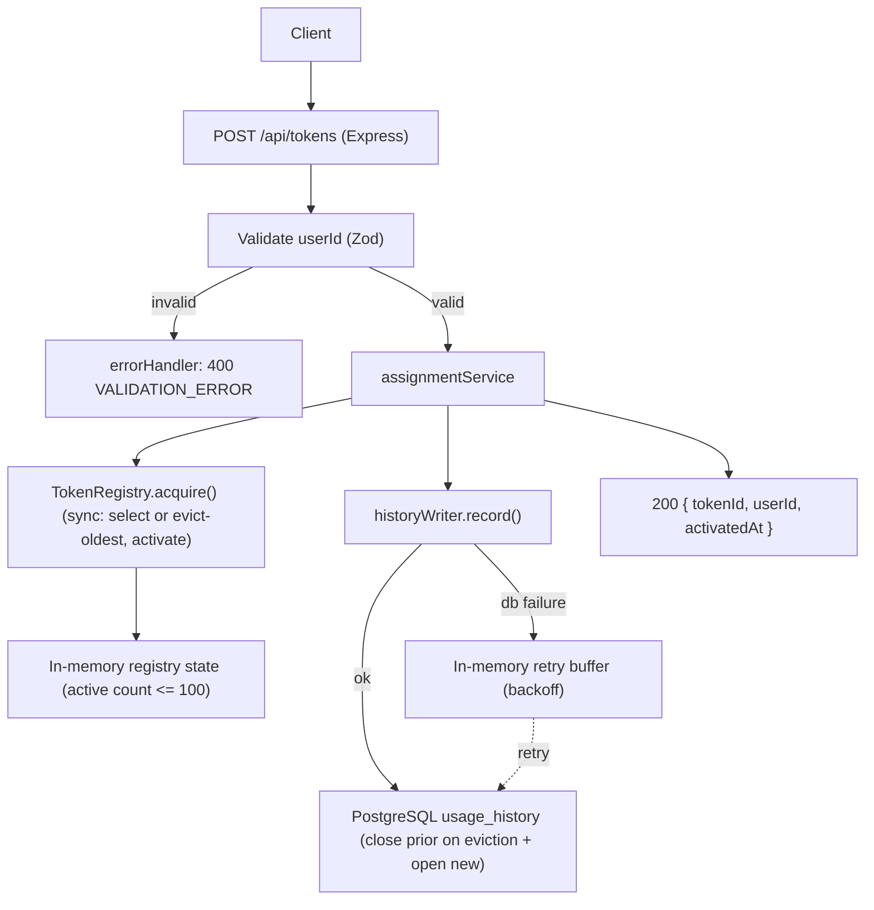

# Technical Spec: F02. Token Assignment and Overflow Eviction

## 1. Technical Overview

**What:** Add the token-assignment endpoint — `POST /api/tokens` — that accepts a client `{ userId }`, validates it as a UUID, and hands back an active token from the fixed pool: `{ tokenId, userId, activatedAt }`. When at least one token is available it is assigned directly; when all 100 are active the **oldest active token** (earliest activation) is evicted and reused, so the call never fails for lack of capacity. Every successful assignment is recorded durably in `usage_history` (F01 schema): a new open hold is written, and on eviction the previous holder's open row is closed with `release_reason = 'eviction'`.

**Why:** F01 seeds the pool and exposes a synchronous in-memory `TokenRegistry` (with `activate`/`release`) but never mutates it. F02 is the single place the 100-token invariant is actually enforced under load. Because the registry is process-local and Node runs one event-loop turn at a time, selecting-and-activating a token **synchronously — with no `await` between the capacity check and the mutation** — serializes concurrent requests for free: the active count can never exceed 100 and no token is handed to two users. The durable history write is deliberately kept off that critical path so the assignment "never fails due to capacity" guarantee also holds when the database is momentarily unavailable.

**Scope:**

**Included:**
- `POST /api/tokens` route (mounted on the F01 base-path router) that validates `{ userId }` and returns `{ tokenId, userId, activatedAt }` with HTTP 200. (PRD *Consumes* F01 registry; *Provides* active assignments + usage-history events.)
- A new synchronous `TokenRegistry.acquire(info)` method: select the first available token, or — when none is available — evict the oldest active token (minimum `activatedAtMonotonic`) and reuse it; then activate it for the new holder. Returns the assigned `tokenId` and the evicted prior holder (if any) so history can be closed. Guarantees `active <= 100` atomically.
- A durable **history writer** owned by F02: on assignment it opens a new `usage_history` row (`started_at = now`, `released_at = NULL`); on eviction it closes the evicted token's open row (`released_at = now`, `release_reason = 'eviction'`) and opens the new one, both in one transaction. It is awaited on the happy path but, on failure, still lets the request return 200 and hands the event to an in-memory retry buffer with backoff (logged if unrecoverable). (PRD F02 *Error Handling*: history-write failure never blocks or fails an assignment.)
- Request validation reusing the F01 error conventions: missing/non-UUID `userId` → HTTP 400 `VALIDATION_ERROR`; malformed/non-JSON body → HTTP 400 (already handled by F01's central `errorHandler`).
- Wiring: thread the history writer through `createApp` → `createApiRouter`, construct it in `src/index.ts` with the DB handle, and flush its buffer on graceful shutdown.

**Excluded (owned by other features / PRD Out of Scope):**
- Automatic TTL release / background sweeper (F03) — F02 only sets the wall-clock and **monotonic** activation timestamps that F03 consumes.
- Pool/token listing (F04), history **query** semantics (F05 — F02 only writes history rows), token detail (F06), clear-active (F07).
- Manual per-token release, keep-alive/renewal, per-request TTLs, multi-instance/shared pool, auth/rate limiting (all PRD *Out of Scope*).

**Decisions / Assumptions (interview + codebase):**
- **Route `POST /api/tokens`** (interview): assignment models "create a hold on the pool", setting the RESTful convention for the sibling family (`GET /api/tokens` F04, `GET /api/tokens/:id` F06, `GET /api/tokens/:id/history` F05, `POST /api/tokens/clear` F07).
- **Atomicity via a synchronous registry method** (interview): the select-or-evict-and-activate sequence runs in a single event-loop turn with no `await`, so Node's single thread serializes it — no mutex/lock needed. The DB history write happens afterward, asynchronously.
- **F02 owns the history writer** (interview): F02 must produce the durable record (acceptance: "each successful assignment records exactly one history entry"), and F05 is a later wave, so F02 builds the write path (open/close + retry buffer); F05 adds only the read/query side.
- **Success body is bare** `{ tokenId, userId, activatedAt }` with HTTP 200 — matching PRD wording and F01's `/health` style (no `{ status: "success", data }` wrapper). Error bodies use the F01 `{ status: "error", error: { code, message } }` envelope.
- **Monotonic activation timestamp** via `performance.now()` populates `ActiveInfo.activatedAtMonotonic` (already declared in the F01 registry). F02 is the first writer of this field; F03 measures TTL against it so clock changes cannot trigger releases early/late.
- **`userId` accepts any RFC 4122 UUID version** (`z.string().uuid()`); the PRD does not constrain the version.
- **Oldest-active selection** uses `activatedAtMonotonic` (strictly increasing per process); on the practically-impossible exact tie, seed (insertion) order breaks it.
- **Eviction is silent** (PRD *Experience*): the previous holder is not notified; their token UUID is simply no longer theirs once its open history row is closed.

## 2. Architecture Impact

**Affected components:**

| Area | Path | New/Modified | Role |
|------|------|--------------|------|
| Assignment route | `src/routes/tokens.ts` | New | `POST /` → validate `{ userId }`, orchestrate acquire + history write, return the assignment. |
| Assignment service | `src/services/assignmentService.ts` | New | Build `ActiveInfo` (wall-clock + monotonic), call `registry.acquire`, then `historyWriter.record`; own the "return 200 even if history write fails" rule. |
| Registry | `src/registry/tokenRegistry.ts` | Modified | Add synchronous `acquire(info)` (select-available or evict-oldest, then activate); expose the evicted prior holder. |
| History writer | `src/services/historyWriter.ts` | New | Durable open/close of `usage_history` rows in a transaction; in-memory retry buffer + backoff; shutdown flush. |
| Base router | `src/routes/index.ts` | Modified | Mount the tokens router; accept the history-writer dependency. |
| App factory | `src/app.ts` | Modified | Extend `AppDeps` with the history writer and pass it to `createApiRouter`. |
| Entrypoint | `src/index.ts` | Modified | Construct the history writer with the DB handle; inject into `createApp`; flush the buffer during `shutdown`. |

**Data flow:**



## 3. Technical Decisions

| Decision | Chosen Approach | Alternative Considered | Trade-off |
|----------|-----------------|------------------------|-----------|
| Concurrency / 100-cap | Synchronous `registry.acquire()` — capacity check and mutation in one event-loop turn, no `await` between them | Async mutex / serialized queue around the acquire path | Zero locking machinery and a provably-correct cap on Node's single thread; accept that the critical section must stay fully synchronous (any future `await` inside it would reopen the race). |
| History write timing | Await on the happy path; on DB failure return 200 anyway and hand off to an in-memory retry buffer | Fire-and-forget enqueue (never await); or block the response on the write | Happy-path rows are durable before responding (good read-after-write for F05/F06) while honoring "never blocks/fails an assignment"; accept a small buffer + background retry and possible loss of a record only if retries are permanently exhausted (logged). |
| Eviction consistency | Close the evicted token's open row (`release_reason = 'eviction'`) and open the new row in a single DB transaction | Two independent writes | History is never left with two open rows for one token or a dropped close; accept a transaction per eviction. |
| Oldest-active selection | Linear scan of the registry map for the minimum `activatedAtMonotonic` | Maintain a sorted structure / min-heap of active tokens | Trivial and clearly correct at the fixed size of 100 (O(100) per full-pool assign); accept O(n) rather than O(log n) — negligible at this scale. |
| Activation timestamp source | Wall-clock `Date` for reporting/`started_at`; `performance.now()` monotonic for ordering/TTL | Single wall-clock value for everything | Eviction order and F03 TTL are immune to system clock changes; accept storing two timestamps per active token (already modeled in F01 `ActiveInfo`). |

## 4. Component Overview

**Backend:**

| File Path | New/Modified | Purpose | Key Responsibilities |
|-----------|--------------|---------|----------------------|
| `src/routes/tokens.ts` | New | Assignment endpoint | Define `POST /`; validate `{ userId }` with Zod (throw `ValidationError` on failure); call the assignment service; respond 200 with `{ tokenId, userId, activatedAt }`. |
| `src/services/assignmentService.ts` | New | Assignment orchestration | Build `ActiveInfo` (`activatedAt = new Date()`, `activatedAtMonotonic = performance.now()`); call `registry.acquire`; invoke `historyWriter.record`; guarantee a successful HTTP result regardless of history-store outcome. |
| `src/registry/tokenRegistry.ts` | Modified | In-memory registry | Add `acquire(info): { tokenId; activatedAt; evicted: EvictedHold \| null }` — pick first available, else evict min-`activatedAtMonotonic` active token, then `activate`; keep `active <= size`. |
| `src/services/historyWriter.ts` | New | Durable history writer | `record({ tokenId, info, evicted })`: in one transaction, close the evicted token's open row (`eviction`) if any and insert the new open row; on failure enqueue to a bounded in-memory retry buffer with exponential backoff; `flush()`/`stop()` for shutdown; never throws to the caller. |
| `src/routes/index.ts` | Modified | Base router | Accept the history writer; mount `createTokensRouter(...)` under the base path. |
| `src/app.ts` | Modified | App factory | Add `historyWriter` to `AppDeps`; forward it to `createApiRouter`. |
| `src/index.ts` | Modified | Startup orchestration | Instantiate `historyWriter` with `db.db` + `logger`; pass into `createApp`; await `historyWriter.flush()` inside `shutdown`. |

**Database:**

| Migration File | Tables Affected | Operation | Notes |
|----------------|-----------------|-----------|-------|
| — (none) | `usage_history` | No schema change | F02 introduces **no** migration. It writes rows to the `usage_history` table created in F01 (`drizzle/0000_init.sql`) using the existing columns, indexes, and `ReleaseReason.EVICTION` constant. |

## 5. API Contracts

**Endpoint: Assign Token**
- **Method:** POST
- **Path:** `/api/tokens` (under `API_BASE_PATH`; default `/api`)
- **Authentication:** None (auth is PRD *Out of Scope*)

**Request:**

| Field | Type | Required | Validation | Description |
|-------|------|----------|------------|-------------|
| `userId` | `string` (uuid) | Yes | RFC 4122 UUID, any version (`z.string().uuid()`) | The client-supplied user that will hold the assigned token. |

**Request Example:**
```json
{
  "userId": "550e8400-e29b-41d4-a716-446655440000"
}
```

**Response (Success — 200):**

| Field | Type | Description |
|-------|------|-------------|
| `tokenId` | `uuid` | The token assigned, always one of the fixed pool of 100. |
| `userId` | `uuid` | Echo of the requesting user. |
| `activatedAt` | `string` (ISO 8601) | Wall-clock activation timestamp; the point from which F03 measures the TTL. |

**Response Example:**
```json
{
  "tokenId": "1b4e28ba-2fa1-11d2-883f-0016d3cca427",
  "userId": "550e8400-e29b-41d4-a716-446655440000",
  "activatedAt": "2026-07-08T12:34:56.789Z"
}
```

**Error Codes:**

| Code | HTTP Status | Description |
|------|-------------|-------------|
| `VALIDATION_ERROR` | 400 | `userId` is missing or not a valid UUID. No token is assigned and no history is written. |
| `VALIDATION_ERROR` | 400 | Request body is malformed / non-JSON (mapped by the F01 central `errorHandler`). |

**Error Example:**
```json
{
  "status": "error",
  "error": {
    "code": "VALIDATION_ERROR",
    "message": "userId must be a valid UUID"
  }
}
```

> Note: there is **no** capacity/"pool full" error path. When every token is active the oldest is evicted, so the endpoint always returns 200 for a well-formed request (PRD *Objectives*: 100% of assignment requests return a token). A transient history-store failure is also not surfaced to the client — the assignment still returns 200 and the write is retried in the background.

## 6. Data Model

F02 adds **no** tables, columns, indexes, or migrations. It writes to the `usage_history` table defined by F01 (see F01 spec §6), using the existing partial index `ix_usage_history_open` to locate open rows and the `ReleaseReason.EVICTION` value.

**Rows F02 produces / mutates in `usage_history`:**

| Operation | When | Effect |
|-----------|------|--------|
| INSERT open hold | Every successful assignment | New row: `token_id`, `user_id`, `started_at = now`, `released_at = NULL`, `release_reason = NULL`. Represents the active hold (PRD *Provides*: usage-history events → F05). |
| UPDATE close (eviction) | Assignment that evicts a full pool's oldest token | The evicted token's single open row (`released_at IS NULL`) is closed: `released_at = now`, `release_reason = 'eviction'`. |

Both statements for an eviction run inside **one transaction** so a token never has two open rows and the close is never dropped. A non-eviction assignment is a single INSERT (an available token has no open row — F01 startup reconciliation and F03/F07 keep it that way).

**Write patterns (illustrative SQL):**
```sql
-- Non-eviction assignment: open a new hold.
INSERT INTO usage_history (token_id, user_id, started_at)
VALUES ($tokenId, $userId, now());

-- Eviction assignment (single transaction): close prior open hold, then open the new one.
BEGIN;
  UPDATE usage_history
     SET released_at = now(), release_reason = 'eviction'
   WHERE token_id = $tokenId AND released_at IS NULL;
  INSERT INTO usage_history (token_id, user_id, started_at)
  VALUES ($tokenId, $newUserId, now());
COMMIT;
```

**Invariants preserved:** the pool stays exactly 100 tokens (F02 only toggles state, never inserts into or deletes from `tokens`); `available + active == 100` after every assignment; at most one open `usage_history` row per token at any time.

## 7. Testing Strategy

**Test File Structure:**

| Test File | Test Type | Target | Coverage Goal |
|-----------|-----------|--------|---------------|
| `tests/unit/tokenRegistry.acquire.test.ts` | Unit | `TokenRegistry.acquire` | 90% |
| `tests/unit/historyWriter.test.ts` | Unit | `src/services/historyWriter` | 90% |
| `tests/integration/assignment.test.ts` | Integration | `POST /api/tokens` + `usage_history` (supertest + real Postgres) | 80% |

**`tests/unit/tokenRegistry.acquire.test.ts`:**

| Test Function | Description | Assertions |
|---------------|-------------|------------|
| `assigns an available token` | Fresh registry, one acquire | Returns a valid `tokenId`; that token is now `active`; `active === 1`; `evicted === null`. |
| `transitions available to active` | Acquire then inspect | `getState(tokenId) === "active"`; `getActiveInfo` holds the passed `userId`/timestamps. |
| `evicts the oldest active token when full` | Fill all 100 with increasing monotonic times, acquire once more | `evicted.tokenId` is the one with the earliest `activatedAtMonotonic`; it is reused for the new holder; `active === 100`. |
| `never exceeds pool size` | Loop `acquire` far past 100 | `active` never exceeds `size` (100) at any point; `available + active === 100` throughout. |
| `breaks exact ties by seed order` | Two active tokens forced to equal monotonic values | The earlier-seeded token is the one evicted. |

**`tests/unit/historyWriter.test.ts`:**

| Test Function | Description | Assertions |
|---------------|-------------|------------|
| `opens a new row on assignment` | `record` with no eviction (mock/real db) | One INSERT with `released_at IS NULL`; correct `token_id`/`user_id`/`started_at`. |
| `closes prior open row on eviction` | `record` with `evicted` set | The evicted token's open row gets `released_at` set and `release_reason === "eviction"`; a new open row is inserted; wrapped in one transaction. |
| `never throws on db failure` | Injected failing db | `record` resolves (does not reject); the event is enqueued to the retry buffer; an error is logged. |
| `retries buffered events with backoff` | Fail then succeed | The buffered event is re-attempted and eventually persisted; buffer drains. |
| `flush drains the buffer on shutdown` | Buffer non-empty, call `flush` | Pending events are attempted; `flush` resolves. |

**`tests/integration/assignment.test.ts` (acceptance — PRD Section 9 F02):**

| Test Function | Description | Assertions |
|---------------|-------------|------------|
| `assigns a token for a valid userId` | POST with a valid UUID | 200; body `{ tokenId, userId, activatedAt }`; the token is now active (visible via `/health` counts). |
| `assigned token transitions available to active` | POST once, check counts | `available` drops by 1 and `active` rises by 1. |
| `rejects missing or non-UUID userId` | POST `{}` and POST `{ userId: "nope" }` | 400 `VALIDATION_ERROR`; `active` unchanged; no `usage_history` row written. |
| `evicts oldest at a full pool and still returns a token` | Assign 100, then assign the 101st | 200 with a token; `active` stays 100; the earliest-activated token's history row is closed with `release_reason = 'eviction'`. |
| `records exactly one history entry per assignment` | N successful assignments | Exactly N open `usage_history` rows created (0 missing, 0 duplicated). |
| `holds the 100-cap under concurrency` | 500 concurrent POSTs | `active` never exceeds 100; no token has two simultaneous open history rows (no double-assignment). |
| `rejects a malformed JSON body` | POST non-JSON payload | 400 `VALIDATION_ERROR` via the F01 error handler. |

**Cross-Feature Integration (PRD Section 9 — criteria referencing F02):**

| Test Function | Description | Assertions |
|---------------|-------------|------------|
| `draws only from the seeded pool (F01↔F02)` | Assign repeatedly | Every returned `tokenId` exists in the `tokens` table; no token outside the fixed 100 is ever produced. |
| `each assignment produces a durable history record (F02↔F05)` | Assign, then read `usage_history` | Every assignment has a corresponding row with matching `token_id`/`user_id`; rows survive a simulated restart (already-persisted rows remain). |
| `activation timestamp is TTL-ready (F02↔F03)` | Inspect a fresh assignment | `activatedAt` (wall-clock) and the stored `activatedAtMonotonic` are set and consistent, giving F03 the reference to release at the 120s threshold. *(Release behavior itself is verified in F03.)* |

> Integration tests run against a real PostgreSQL (disposable test database/container) so the `usage_history` writes, the eviction transaction, and the `tokens ⇄ usage_history` foreign key are exercised end-to-end.
