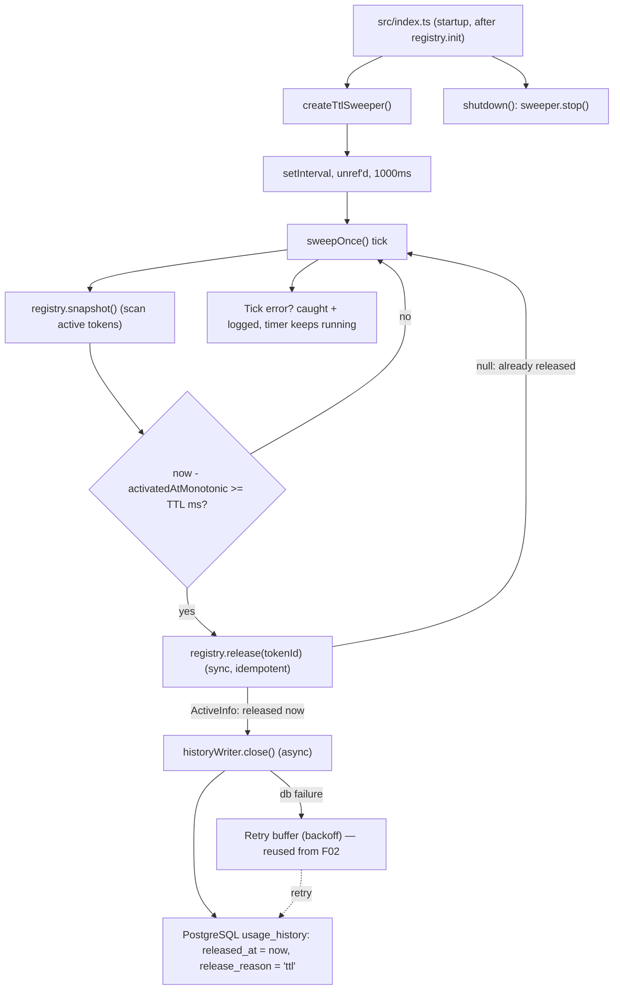

# Technical Spec: F03. Automatic TTL Release

## 1. Technical Overview

**What:** A background mechanism that reclaims any active token whose hold has lasted `TOKEN_TTL_SECONDS` (default 120s), returning it to `available` and closing its open `usage_history` row with `release_reason = 'ttl'`. There is no client-facing surface: no new route, no new request/response contract. The mechanism runs entirely inside the process, mutating the same in-memory `TokenRegistry` that F02 mutates and writing through the same durable history writer F02 already built.

**Why:** F02 assigns tokens but never releases them; without F03, a client that crashes or forgets its token would starve the pool forever, undermining the product's core "leaked allocations can never happen" guarantee. F02 already lays every rail F03 needs: `TokenRegistry.release(tokenId)` exists, is synchronous, and is already idempotent (a no-op on an already-available token); `ActiveInfo.activatedAtMonotonic` (via `performance.now()`) already exists specifically so TTL math is immune to wall-clock changes; and `ReleaseReason.TTL = "ttl"` is already reserved in the schema. F03's job is almost entirely to *drive* those existing seams on a timer, plus teach the history writer how to close a row without also opening one (its current `record()` only closes-then-opens, for the eviction case).

**Scope:**

**Included (Core Scope only — see Assumption A1):**
- A periodic background sweep (`src/services/ttlSweeper.ts`) that, on a fixed interval, scans the registry for active tokens whose elapsed time since `activatedAtMonotonic` has reached `config.TOKEN_TTL_SECONDS` × 1000 ms, and releases each one.
- Reuse of the existing, already-idempotent `TokenRegistry.release(tokenId)` as the **only** in-memory mutation point — F03 adds no new registry method.
- A new `HistoryWriter.close(...)` operation that closes the token's open `usage_history` row (`released_at = now`, `release_reason = 'ttl'`) without opening a new one, reusing the writer's existing per-token ordering chain and retry/backoff buffer.
- Startup/shutdown wiring in `src/index.ts`: construct and start the sweeper once the registry is initialized; stop it during graceful `shutdown()`, mirroring how `historyWriter.stop()` is already called.
- Per-tick failure isolation so a thrown error or a rejected history write inside one sweep pass is logged and swallowed, never escaping the timer callback or crashing the process.

**Deferred (Full Scope additions — out of scope per Assumption A1):**
- Per-deployment TTL configuration beyond the existing `TOKEN_TTL_SECONDS` env var (e.g., a runtime-tunable or admin-facing TTL).
- Release metrics/logging beyond a single error-level log line on failure (counters, dashboards, structured release events).
- Tuning of the release strategy itself — e.g., switching between a periodic sweep and precise per-token scheduling, or exposing the sweep interval as configuration.

**Excluded (owned by other features / PRD Out of Scope):**
- Pool/token listing (F04), usage-history query endpoints (F05), token detail (F06), clear-active (F07) — F03 only mutates state and history; it exposes nothing new to read.
- Manual per-token release, keep-alive/renewal, per-request TTLs, multi-instance/shared pool, auth/rate limiting (all PRD *Out of Scope*).

**Decisions / Assumptions (Auto-Accept Policy — Step 2 skipped):**
- **A1 — Scope: Core only.** The PRD's Core Scope for F03 is exactly "release any token active for 120 seconds back to available"; the Full Scope items listed above are deferred per the batch default (Scope default = Core only).
- **A2 — Mechanism: periodic sweep.** The PRD explicitly leaves the mechanism open ("a supervised process that tracks each token, a per-token scheduled job, or a periodic sweep"). A periodic sweep is chosen: it matches the PRD's own worked example ("every 1 second"), requires no per-token timer bookkeeping or cancellation when a token is evicted/cleared early, and mirrors the unref'd-timer idiom already established in `historyWriter.ts`.
- **A3 — Sweep interval: 1000ms, fixed.** Chosen as a hardcoded constant (not an env var, since interval tuning is a deferred Full Scope item). At 1s, worst-case detection latency is ~1s, comfortably inside the 5-second SLA (PRD Objectives / Section 9).
- **A4 — TTL threshold source: `config.TOKEN_TTL_SECONDS`.** F01 already defines this Zod-validated env var with default `120`, but no code reads it yet. F03 reads it instead of hardcoding `120`, avoiding a second source of truth for the same number; this is wiring to existing infrastructure, not new configurability (the deferred Full Scope item is a further step beyond this — e.g., changing TTL without a restart).
- **A5 — Time source: monotonic only.** Elapsed time is computed as `performance.now() - activatedAtMonotonic`, never `Date.now() - activatedAt`, per PRD Error Handling ("clock skew... measured with a monotonic time source").
- **A6 — History close reuses the writer's per-token chain.** Rather than a standalone close path, `HistoryWriter.close()` enqueues onto the same `tokenChains` ordering used by `record()`, so a TTL close for token X is guaranteed to resolve before any later reassignment "open" for the same token id started after it (e.g., token released by TTL and immediately reassigned).
- **A7 — "Supervised restart" = self-healing fixed-interval timer.** Each tick's body is wrapped in error isolation (try/catch for sync errors, `.catch` for the async history close) so one bad tick never stops the `setInterval`; the next already-scheduled tick is the "restart." No external process supervisor is introduced. As a secondary catch-up path, a token missed by a failed tick remains the oldest active token and is therefore still eligible for F02's oldest-first eviction if the pool later fills up, per PRD Error Handling ("caught on the next tick or at the next assignment").
- **A8 — Idempotency delegated to the registry.** `TokenRegistry.release()` already returns `null` as a no-op when called on a token that is not active. The sweeper treats a `null` return as "already released elsewhere" and skips the history close entirely for that token — this is the mechanism behind the "no error, no state change" requirement.

## 2. Architecture Impact

**Affected components:**

| Area | Path | New/Modified | Role |
|------|------|--------------|------|
| TTL sweeper | `src/services/ttlSweeper.ts` | New | Periodic scan-and-release of expired active tokens; owns the sweep timer's lifecycle (`start`/`stop`) and per-tick failure isolation. |
| History writer | `src/services/historyWriter.ts` | Modified | Add `close(tokenId, releasedAt, reason)`: close an already-open row without opening a new one; reuse the existing per-token chain and retry buffer. |
| Entrypoint | `src/index.ts` | Modified | Construct the sweeper with `{ registry, historyWriter, ttlSeconds: config.TOKEN_TTL_SECONDS, logger }` after `registry.init(...)`; call `sweeper.start()`; call `sweeper.stop()` inside `shutdown()` alongside `historyWriter.stop()`. |

Not touched: `src/app.ts`, `src/routes/*`, `src/registry/tokenRegistry.ts` (its existing `release`/`snapshot` are sufficient), `src/config/index.ts` (the field it needs already exists), `src/db/schema.ts` (the `ReleaseReason.TTL` value it needs already exists).

**Data flow:**



## 3. Technical Decisions

| Decision | Chosen Approach | Alternative Considered | Trade-off |
|----------|-----------------|------------------------|-----------|
| Release mechanism | Single `setInterval` periodically scanning the whole registry | Per-token `setTimeout` scheduled at acquire time | Simpler: no per-token timer bookkeeping or cancellation when a token is evicted/cleared before its TTL fires; O(pool size) = O(100) scan per tick is negligible; accept up to one sweep-interval of latency instead of near-zero latency. |
| Sweep interval | Fixed constant `1000ms` | Configurable via env var | Meets the 5s SLA with ample margin using a single constant; interval tuning is explicitly deferred (Full Scope), so no new config surface is added now. |
| TTL threshold source | Read existing `config.TOKEN_TTL_SECONDS` (default 120s) | Hardcode `120` in the sweeper | One source of truth for the TTL value; the existing default already equals the Core Scope requirement, so this is wiring, not new configurability. |
| Elapsed-time source | `performance.now()` vs. stored `activatedAtMonotonic` | `Date.now()` vs. stored `activatedAt` | Immune to system clock adjustments (PRD Error Handling); reuses the field F02 already populates for exactly this purpose. |
| History close write | New `HistoryWriter.close()`, reusing the existing per-token ordering chain and retry buffer | A separate, dedicated writer/queue for TTL closes | Guarantees a TTL close for token X is ordered before a later reassignment "open" for the same token id; reuses proven retry/backoff machinery instead of duplicating it. |
| Failure isolation | Wrap each tick so a thrown/rejected error is caught, logged, and swallowed | Let an uncaught error propagate and rely on an external process manager to restart the service | The fixed-interval timer is unaffected by one bad tick and keeps firing on schedule — any release missed by a failed tick is caught on the very next tick, satisfying "supervised restart" with no external supervisor. |
| Idempotency handling | Treat `registry.release()`'s existing `null` return as "skip, no history call" | Have the sweeper pre-check state before releasing (check-then-act) | A single synchronous call is both the check and the mutation (matches the registry's established idempotent-release contract from F02/F07); avoids a redundant read plus a TOCTOU gap that doesn't exist in a single-threaded event loop anyway. |

## 4. Component Overview

**Backend:**

| File Path | New/Modified | Purpose | Key Responsibilities |
|-----------|--------------|---------|----------------------|
| `src/services/ttlSweeper.ts` | New | Periodic TTL sweep | Expose `createTtlSweeper(deps)` returning `{ start(): void; stop(): Promise<void>; sweepOnce(): Promise<void> }`. `sweepOnce` synchronously scans `registry.snapshot()` for active tokens past TTL, synchronously calls `registry.release(tokenId)` for each (no `await` between scan and release, honoring the registry's synchronous-mutation invariant), then asynchronously calls `historyWriter.close(...)` for every token actually released (skips tokens where `release()` returned `null`). `start()` schedules `sweepOnce` on an unref'd `setInterval` (default 1000ms, overridable for tests) with the tick body wrapped for failure isolation; `stop()` clears the interval and awaits any in-flight close calls. |
| `src/services/historyWriter.ts` | Modified | Durable history writer | Add `close(input: { tokenId; releasedAt; reason })` to the `HistoryWriter` interface and `DbHistoryWriter`: a single `UPDATE ... WHERE token_id = ? AND released_at IS NULL` (no transaction needed — unlike `record`'s eviction path, no companion insert). Enqueues onto the same per-token `tokenChains` map as `record()` for ordering, and onto the same bounded retry buffer (generalized to carry either an "open" or "close" operation) on failure. |
| `src/index.ts` | Modified | Startup orchestration | After `registry.init(tokenIds)`, construct `createTtlSweeper({ registry, historyWriter, ttlSeconds: config.TOKEN_TTL_SECONDS, logger })` and call `.start()`. Add `await ttlSweeper.stop()` inside `shutdown()`, alongside the existing `await historyWriter.stop()`. |

**Database:**

No new tables, columns, indexes, or migrations. F03 writes exclusively through `HistoryWriter.close()` to the existing `usage_history` table (F01 schema), using the already-reserved `ReleaseReason.TTL = "ttl"` constant and the existing partial index `ix_usage_history_open` to locate the row being closed.

## 5. API Contracts

No new endpoints — F03 is a background mechanism with no client-facing surface. It does not add to, or modify, `AppDeps`, `createApp`, or any route file. The only externally observable effect is state that other features' endpoints will later expose (F04 listing, F06 detail): a previously-active token becomes `available` again in the registry, and its `usage_history` row gains a `released_at`/`release_reason = 'ttl'`.

## 6. Data Model

F03 introduces no schema changes. It interacts with the `usage_history` table defined by F01 (see F01 spec §6) purely through updates to existing columns.

**Rows F03 mutates in `usage_history`:**

| Operation | When | Effect |
|-----------|------|--------|
| UPDATE close (TTL) | A sweep tick finds an active token whose elapsed monotonic time ≥ `TOKEN_TTL_SECONDS` | The token's single open row (`released_at IS NULL`) is closed: `released_at = now`, `release_reason = 'ttl'`. No row is inserted (unlike F02's eviction close-then-open). |

**Write pattern (illustrative SQL):**
```sql
UPDATE usage_history
   SET released_at = now(), release_reason = 'ttl'
 WHERE token_id = $tokenId
   AND released_at IS NULL;
```

If the row was already closed by a racing eviction or clear-active before the sweep's write runs, the `WHERE released_at IS NULL` predicate matches zero rows — a harmless no-op UPDATE, consistent with PRD Error Handling ("no-op, no error"). In practice this case is normally short-circuited earlier: `registry.release()` already returns `null` for a token no longer active, so `historyWriter.close()` is typically never even called for it.

**Invariants preserved:** the pool stays exactly 100 tokens (F03 never touches `tokens`); `available + active == 100` after every sweep tick; at most one open `usage_history` row per token at any time; a closed row is never re-closed with a different `release_reason`.

## 7. Testing Strategy

**Test File Structure:**

| Test File | Test Type | Target | Coverage Goal |
|-----------|-----------|--------|---------------|
| `tests/unit/ttlSweeper.test.ts` | Unit | `src/services/ttlSweeper` | 90% |
| `tests/unit/historyWriter.close.test.ts` | Unit | `HistoryWriter.close` | 90% |
| `tests/integration/ttlRelease.test.ts` | Integration | Background TTL release end-to-end (supertest + real Postgres) | 80% |

**`tests/unit/ttlSweeper.test.ts`:**

| Test Function | Description | Assertions |
|---------------|-------------|------------|
| `releases a token whose monotonic age has reached the TTL` | Registry with one active token seeded at `performance.now() - ttlMs`; call `sweepOnce()` | `registry.getState(tokenId) === "available"`; `historyWriter.close` called once with `{ tokenId, reason: "ttl" }`. |
| `leaves tokens under the TTL threshold active` | Active token seeded well under the TTL | Token remains `active`; `historyWriter.close` not called for it. |
| `releases a token exactly at the 120s threshold using activatedAtMonotonic (F02↔F03)` | Token seeded with `activatedAtMonotonic` exactly `ttlMs` in the past (boundary, using the real `ActiveInfo` shape F02 produces) | Token is released on that tick (threshold is inclusive: `elapsed >= ttlMs`). |
| `ignores wall-clock changes and measures elapsed time via monotonic time` | `vi.setSystemTime` jumps the wall clock forward by hours while the token's real monotonic elapsed time stays under the TTL, and vice versa | Release decision tracks only the monotonic elapsed time, never the wall-clock jump. |
| `is idempotent when release races with another release path` | Fake registry double: `snapshot()` reports a due active token but `release()` returns `null` (simulating an eviction/clear that already released it) | `sweepOnce()` resolves without throwing; `historyWriter.close` is not called for that token. |
| `isolates a single tick's failure without stopping the sweeper` | Force `historyWriter.close` to reject once | `sweepOnce()` does not throw/reject uncaught; error is logged; a subsequent `sweepOnce()` call still releases a newly-due token correctly. |
| `start() schedules recurring sweeps and stop() halts them` | Real short `intervalMs` (e.g. 20ms) via constructor override; one token already due at start | `vi.waitFor` observes the token released after ~one interval; after `stop()`, a newly-due token is not auto-released by further ticks. |
| `sweep timer is unref'd so it never keeps the process alive` | Spy on the timer handle returned by `start()` | `.unref` is called on the interval handle, matching the codebase's existing timer idiom. |

**`tests/unit/historyWriter.close.test.ts`:**

| Test Function | Description | Assertions |
|---------------|-------------|------------|
| `closes an open row with the given release reason` | `FakeDb` (same double pattern as `historyWriter.test.ts`) with an existing open row; call `writer.close({ tokenId, releasedAt, reason: "ttl" })` | Exactly one UPDATE with `releasedAt` and `releaseReason: "ttl"`; no INSERT triggered; no transaction used (single statement, unlike the eviction path). |
| `never throws on a db failure and buffers the close for retry` | `FakeDb` configured to fail once | `close()` resolves without rejecting; error logged; the buffered close is retried and eventually applied (same retry mechanics as `record()`). |
| `orders a close before a later open for the same token (F02↔F03)` | Call `close()` then immediately `record()` (no eviction) for the same `tokenId`, without awaiting the first | The UPDATE from `close()` completes before the INSERT from `record()` is attempted, per the shared per-token chain — asserted via call-order tracking in the `FakeDb`/`FakeTx` double. |

**`tests/integration/ttlRelease.test.ts` (acceptance — PRD Section 9 F03):**

*Boots the service with `TOKEN_TTL_SECONDS=1` (via `process.env` override in the `boot()` helper, following `assignment.test.ts`'s pattern) so the TTL is exercised in real time without a 120s-long test.*

| Test Function | Description | Assertions |
|---------------|-------------|------------|
| `releases an active token automatically once its TTL elapses` | Boot with `TOKEN_TTL_SECONDS=1`; POST an assignment; poll `/health` | `available` returns to 100 and `active` to 0 within a bounded wait (`vi.waitFor`, generous multiple of the 1s TTL); the token's `usage_history` row is closed with `release_reason = 'ttl'`. |
| `release occurs within the 5-second SLA of the threshold` | Assign, record the response `activatedAt`; poll `svc.registry.getState(tokenId)` | Time between `activatedAt + TOKEN_TTL_SECONDS` and the observed transition to `available` is ≤ 5 seconds. |
| `a released token becomes assignable again immediately` | After the TTL release is observed, POST a new assignment | The new assignment succeeds (200) and can draw the just-released token id back into `active` with no additional delay. |
| `releasing an already-released token is a no-op (race with eviction)` | Assign a token, then immediately call `svc.registry.release(tokenId)` directly (simulating an F02 eviction/F07 clear that beat the sweeper to it); wait past the TTL window | No error surfaces (server keeps responding normally); the token's `usage_history` row shows exactly one release (not overwritten a second time to `'ttl'`). |
| `uses F02's activation timestamp to release exactly at the configured threshold (F02↔F03)` | POST an assignment (F02's `assignmentService` sets `activatedAt`/`activatedAtMonotonic`); observe the release timing relative to that specific response's `activatedAt` | The release is measured from the timestamp F02 actually recorded, not from a separately-tracked time, confirming the shared `ActiveInfo` contract between F02 and F03. |

> Cross-Feature Integration note: PRD Section 9 also expects F03's reclaimed state to be visible to listing (F04) and detail (F06) reads. Those endpoints are not yet implemented (later waves); F03's own tests verify the underlying state change via `/health` and direct registry inspection (the same state F04/F06 will read), and F04/F06 will add their own read-path assertions once built.

> Integration tests run against a real PostgreSQL (disposable test database/container, via `tests/helpers/db.ts`), so the history-close UPDATE and the `tokens ⇄ usage_history` relationship are exercised end-to-end, consistent with F01/F02's integration test setup.
