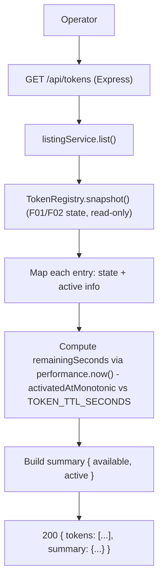

# Technical Spec: F04. Token and Pool Listing

## 1. Technical Overview

**What:** Add a read-only listing endpoint — `GET /api/tokens` — that returns a full, single-response snapshot of the fixed 100-token pool: every token's `tokenId` and `state`, plus `userId`, `activatedAt`, and `remainingSeconds` for each token currently active, plus a `summary` of `available`/`active` counts that always sum to 100. The endpoint reuses the `TokenRegistry.snapshot()` method already established by F01 and populated by F02's `acquire`/`activate` mutations — F04 adds no new state, only a read projection over state that already exists.

**Why:** F01 (registry) and F02 (assignment) give operators no way to see the pool without instrumenting every client (PRD Problem: "No visibility into who holds what"). F04 is the first observability read: a single GET that answers "what is the current saturation, and who holds what, for how much longer" in one response, which is exactly the shape `TokenRegistry.snapshot()` was already designed to return ("a consistent point-in-time snapshot of every token's state (F04/F06)").

**Scope:**

**Included (Core Scope, PRD Section 6 F04):**
- `GET /api/tokens` returning all 100 tokens with `{ tokenId, state }`, and for active tokens additionally `{ userId, activatedAt, remainingSeconds }`.
- A `summary: { available, active }` whose values always sum to the pool size (100).
- Computation of `remainingSeconds` from the monotonic activation reference already recorded by F02 (`ActiveInfo.activatedAtMonotonic`) and the configured TTL (`TOKEN_TTL_SECONDS`, default 120), so the value is immune to wall-clock changes (consistent with F03's TTL measurement approach).

**Deferred (Full Scope additions, PRD Section 6 F04 — explicitly out of scope for this spec):**
- Filtering the list by state (`available` / `active`).
- Sorting the list by remaining time.
- Pagination of the list output.

> These three are named verbatim in the PRD's F04 "Full Scope additions" block. Per the Auto-Accept Policy (batch mode, no interview), Core Scope only is implemented; the endpoint always returns the full, unfiltered, unpaginated 100-entry list.

**Decisions / Assumptions (Auto-Accept Policy — batch mode, no interview):**

| # | Decision | Auto-Accept default applied | Rationale |
|---|----------|------------------------------|-----------|
| 1 | Scope | Core Scope only; filter/sort/pagination deferred | Auto-Accept Policy default: Core over Core+Full when both blocks exist in the PRD. |
| 2 | Endpoint path | `GET /api/tokens`, added to the existing `src/routes/tokens.ts` router | F02's spec already declared the RESTful convention for the sibling family (`GET /api/tokens` F04, `GET /api/tokens/:id` F06, `POST /api/tokens/clear` F07) and `src/routes/index.ts` already comments "F04 listing... attach here later" on the same `tokens` mount. Reusing the same router file (not a new one) matches the one-router-per-resource pattern already in place. |
| 3 | Response envelope | `{ tokens: RegistryListEntry[], summary: { available, active } }`, no additional `{status, data}` wrapper | The codebase convention (F01 `/health`, F02 `POST /tokens`) is a bare top-level JSON object with no generic wrapper. A JSON HTTP response body is exactly one JSON value, and the PRD requires both a 100-entry array *and* a 2-field summary object in the same response — a bare top-level array cannot also carry named summary fields, so the only structure consistent with "bare object, no wrapper" that satisfies both requirements is a top-level object with two named fields, `tokens` and `summary`. |
| 4 | `remainingSeconds` computation | `max(0, floor(TOKEN_TTL_SECONDS - (performance.now() - activatedAtMonotonic) / 1000))` | `TOKEN_TTL_SECONDS` (config, default 120) and `activatedAtMonotonic` (`performance.now()` reference stamped by F02) are the only TTL-relevant values already in the codebase (used identically by F03 for release timing). Flooring rounds down to whole seconds so the reported value never overstates remaining time; clamping at 0 covers the window between TTL expiry and F03's next sweep, where a token is logically expired but not yet released — reporting 0 rather than a negative number is the industry-standard clamp for a countdown display. |
| 5 | Component split (route vs. service) | New `src/services/listingService.ts` factory, route stays thin | F02's precedent (`src/routes/tokens.ts` calls `assignmentService.assign(...)`; it never touches `TokenRegistry` directly) is the only existing read/write route in the codebase and it delegates to a service. F04 follows the same pattern for consistency and testability: the service owns the snapshot→response transformation (pure, synchronous, independently unit-testable) and the config-sourced `ttlSeconds`; the route only wires HTTP in/out. |
| 6 | Dependency wiring | `ttlSeconds` (from `config.TOKEN_TTL_SECONDS`) threaded through `AppDeps` → `ApiRouterDeps` → `createListingService` | No existing path carries `TOKEN_TTL_SECONDS` past `src/index.ts` into route construction; F03 (TTL release) will need the same value and can reuse this wiring once it lands. Threading it as a plain `number` (not the whole `AppConfig`) keeps the service's dependency surface minimal, matching `AssignmentServiceDeps`'s style of narrow, explicit deps. |
| 7 | Query parameters | None accepted in Core Scope | PRD Core Scope has no filter/sort/paging parameters; Full Scope's `state` filter, remaining-time sort, and pagination params are deferred (assumption #1). |

## 2. Architecture Impact

**Affected components:**

| Area | Path | New/Modified | Role |
|------|------|--------------|------|
| Listing service | `src/services/listingService.ts` | New | Read `registry.snapshot()`, compute `remainingSeconds` per active token, build the `{ tokens, summary }` response. |
| Tokens route | `src/routes/tokens.ts` | Modified | Add `GET /` handler; calls `listingService.list()` and returns the result with HTTP 200. |
| Base router | `src/routes/index.ts` | Modified | Construct `listingService` from `registry` + `ttlSeconds`; pass both services into `createTokensRouter(...)`. |
| App factory | `src/app.ts` | Modified | Add `ttlSeconds` to `AppDeps`; forward it to `createApiRouter`. |
| Entrypoint | `src/index.ts` | Modified | Pass `config.TOKEN_TTL_SECONDS` into `createApp(...)` as `ttlSeconds`. |

**Data flow:**



## 3. Technical Decisions

| Decision | Chosen Approach | Alternative Considered | Trade-off |
|----------|-----------------|-------------------------|-----------|
| Read source | `TokenRegistry.snapshot()` (already implemented, purpose-documented for F04/F06) | Query `tokens` table + reconstruct active state from `usage_history` | The in-memory registry is the single source of truth for active state (PRD Out of Scope: active state is process-local); the DB has no `active`/`remainingSeconds` columns, so a DB-only read cannot produce this response. `snapshot()` is O(pool size) and already consistent point-in-time by construction. |
| Route placement | Add `GET /` to the existing `src/routes/tokens.ts` (same router as F02's `POST /`) | A new `src/routes/tokenListing.ts` router mounted separately | One router per resource (`/tokens`) keeps method-per-verb grouped in one file, matching the base router's existing comment listing F04–F07 as later additions to the same mount. |
| Response shape | Single object `{ tokens, summary }` | Bare top-level array `[...]` with counts as response headers; or a `{status:"success", data:{...}}` wrapper | A bare array cannot also carry the required summary fields in one JSON body; a generic wrapper contradicts the established bare-object convention (F01 `/health`, F02 `POST /tokens`). `{ tokens, summary }` is the minimal structure satisfying both constraints. |
| `remainingSeconds` clamp | `max(0, floor(...))` | Allow negative values when past TTL but not yet swept by F03 | A negative "remaining time" is meaningless to an operator reading a countdown; clamping at 0 accurately communicates "expired, pending release" without requiring F04 to know about F03's sweep internals. |
| Service vs. inline route logic | Dedicated `listingService` factory | Compute the response shape directly inside the route handler | Matches F02's route→service precedent; keeps the transformation (pure function of `snapshot()` + `ttlSeconds` + "now") unit-testable without spinning up Express/supertest. |

## 4. Component Overview

**Backend:**

| File Path | New/Modified | Purpose | Key Responsibilities |
|-----------|--------------|---------|----------------------|
| `src/services/listingService.ts` | New | Pool listing orchestration | Call `registry.snapshot()`; for each entry with `active !== null`, compute `remainingSeconds` from `activatedAtMonotonic` and `ttlSeconds`; assemble `tokens[]` and `summary { available, active }` from `registry.available`/`registry.active`. |
| `src/routes/tokens.ts` | Modified | Listing endpoint | Add `router.get("/", ...)`: no request validation needed (no params in Core Scope); call `listingService.list()`; respond 200 with the result; forward unexpected errors to `next(err)`. |
| `src/routes/index.ts` | Modified | Base router wiring | Accept `ttlSeconds` in `ApiRouterDeps`; construct `listingService` via `createListingService({ registry, ttlSeconds })`; pass both `assignmentService` and `listingService` into `createTokensRouter(...)`. |
| `src/app.ts` | Modified | App factory wiring | Add `ttlSeconds: number` to `AppDeps`; forward it into `createApiRouter({ registry, historyWriter, ttlSeconds })`. |
| `src/index.ts` | Modified | Startup wiring | Pass `ttlSeconds: config.TOKEN_TTL_SECONDS` into `createApp({...})`. |

## 5. API Contracts

**Endpoint: List Tokens**
- **Method:** GET
- **Path:** `/api/tokens` (under `API_BASE_PATH`; default `/api`)
- **Authentication:** None (auth is PRD *Out of Scope*)

**Request:** No path or body parameters. No query parameters in Core Scope (Full Scope's `state` filter, sort, and pagination params are deferred — see Scope).

**Response (Success — 200):**

| Field | Type | Description |
|-------|------|--------------|
| `tokens` | `array` | Exactly `POOL_SIZE` (100) entries, one per token in the fixed pool. |
| `tokens[].tokenId` | `uuid` | The token's stable identity. |
| `tokens[].state` | `"available" \| "active"` | Current state from the registry. |
| `tokens[].userId` | `uuid` (present only when `state === "active"`) | The current holder's user UUID. |
| `tokens[].activatedAt` | `string` (ISO 8601, present only when `state === "active"`) | Wall-clock activation timestamp (same value F02 returned at assignment time). |
| `tokens[].remainingSeconds` | `integer` (present only when `state === "active"`) | Seconds remaining until TTL release; `max(0, floor(TOKEN_TTL_SECONDS - elapsedSeconds))`. |
| `summary` | `object` | Pool-wide counts. |
| `summary.available` | `integer` | Count of tokens in the available state. |
| `summary.active` | `integer` | Count of tokens in the active state. Always `summary.available + summary.active === POOL_SIZE`. |

**Response Example:**
```json
{
  "tokens": [
    {
      "tokenId": "1b4e28ba-2fa1-11d2-883f-0016d3cca427",
      "state": "active",
      "userId": "550e8400-e29b-41d4-a716-446655440000",
      "activatedAt": "2026-07-09T12:34:56.789Z",
      "remainingSeconds": 87
    },
    {
      "tokenId": "9c858901-8a57-4791-81fe-4c455b099bc9",
      "state": "available"
    }
  ],
  "summary": {
    "available": 99,
    "active": 1
  }
}
```

**Error Codes:**

| Code | HTTP Status | Description |
|------|-------------|--------------|
| `INTERNAL_ERROR` | 500 | Unexpected failure reading the registry (mapped by the F01 central `errorHandler`); no endpoint-specific error path exists since the request carries no parameters to validate. |

> Note: unlike F02, there is no `VALIDATION_ERROR` path — the endpoint takes no input in Core Scope, so every well-formed `GET /api/tokens` request succeeds.

## 6. Data Model

**No schema changes.** F04 introduces no new tables, columns, indexes, or migrations. It reads exclusively from the existing in-memory `TokenRegistry` (`registry.snapshot()`, populated by F01's `init()` and F02's `acquire()`/`activate()`), which mirrors the durable `tokens` identity set (F01 `drizzle/0000_init.sql`) without querying PostgreSQL on the request path. `usage_history` (F01/F02) is not read by this endpoint — history querying is F05/F06's concern.

## 7. Testing Strategy

**Test File Structure:**

| Test File | Test Type | Target | Coverage Goal |
|-----------|-----------|--------|---------------|
| `tests/unit/listingService.test.ts` | Unit | `src/services/listingService` | 90% |
| `tests/integration/listing.test.ts` | Integration | `GET /api/tokens` (supertest + real Postgres via `tests/helpers/db.ts`) | 80% |

**`tests/unit/listingService.test.ts`:**

| Test Function | Description | Assertions |
|----------------|-------------|------------|
| `lists all tokens with correct state` | Registry with a mix of available/active tokens | Returned `tokens` has one entry per registry token; `state` matches `registry.getState(tokenId)` for each. |
| `includes userId, activatedAt, remainingSeconds only for active tokens` | Registry with one active, one available token | Active entry has all three fields populated with the correct `userId`/`activatedAt`; available entry omits them. |
| `computes remainingSeconds from ttlSeconds and elapsed monotonic time` | Activate a token with a known `activatedAtMonotonic`, advance a fake/mocked `performance.now()` | `remainingSeconds === ttlSeconds - elapsedSeconds` (floored). |
| `clamps remainingSeconds at zero past TTL` | Activate a token, advance elapsed time beyond `ttlSeconds` | `remainingSeconds === 0`, never negative. |
| `summary counts sum to pool size` | Registry with an arbitrary mix of active/available across the full pool | `summary.available + summary.active === registry.size`; `summary.active === registry.active`; `summary.available === registry.available`. |
| `returns an empty-active summary for a freshly initialized pool` | Registry just `init()`'d, nothing activated | `summary === { available: size, active: 0 }`; no `tokens[]` entry has `userId`/`activatedAt`/`remainingSeconds`. |

**`tests/integration/listing.test.ts` (acceptance — PRD Section 9 F04):**

| Test Function | Description | Assertions |
|----------------|-------------|------------|
| `lists all 100 tokens with their correct states` | Boot a fresh service, GET `/api/tokens` | 200; `tokens.length === 100`; every `tokenId` is unique and present in the seeded `tokens` table. |
| `active token entries include current user and remaining time` | Assign one token via `POST /api/tokens`, then GET `/api/tokens` | The matching entry has `state === "active"`, `userId` equal to the assigned user, `activatedAt` matching the assignment response, and `remainingSeconds` a positive integer `<= TOKEN_TTL_SECONDS`. |
| `summary available and active counts sum to exactly 100` | Assign a handful of tokens, then GET `/api/tokens` | `summary.available + summary.active === 100`; `summary.active` equals the number of assignments made. |

**Cross-Feature Integration (PRD Section 9 — criteria referencing F04):**

| Test Function | Description | Assertions |
|----------------|-------------|------------|
| `listing reflects registry state and active assignments (F01↔F02↔F04)` | Assign several tokens (F02), evict via a full pool if applicable, then GET `/api/tokens` | Every token's `available`/`active` state in the response matches `registry.getState(tokenId)` (F01); every active entry's `userId`/`activatedAt` matches `registry.getActiveInfo(tokenId)` (F02) exactly. |
| `eviction is visible in the next listing (F02↔F04)` | Fill the pool to 100, trigger an eviction with the 101st assignment, then GET `/api/tokens` | The evicted token's entry now shows the new holder's `userId`/`activatedAt`, not the evicted user's; `summary.active` stays 100. |

> Integration tests boot the full service via `start()` (as in `tests/integration/assignment.test.ts`) against a real PostgreSQL (`tests/helpers/db.ts`), since the registry is populated from the seeded `tokens` table at startup even though the listing read itself never touches the database.
