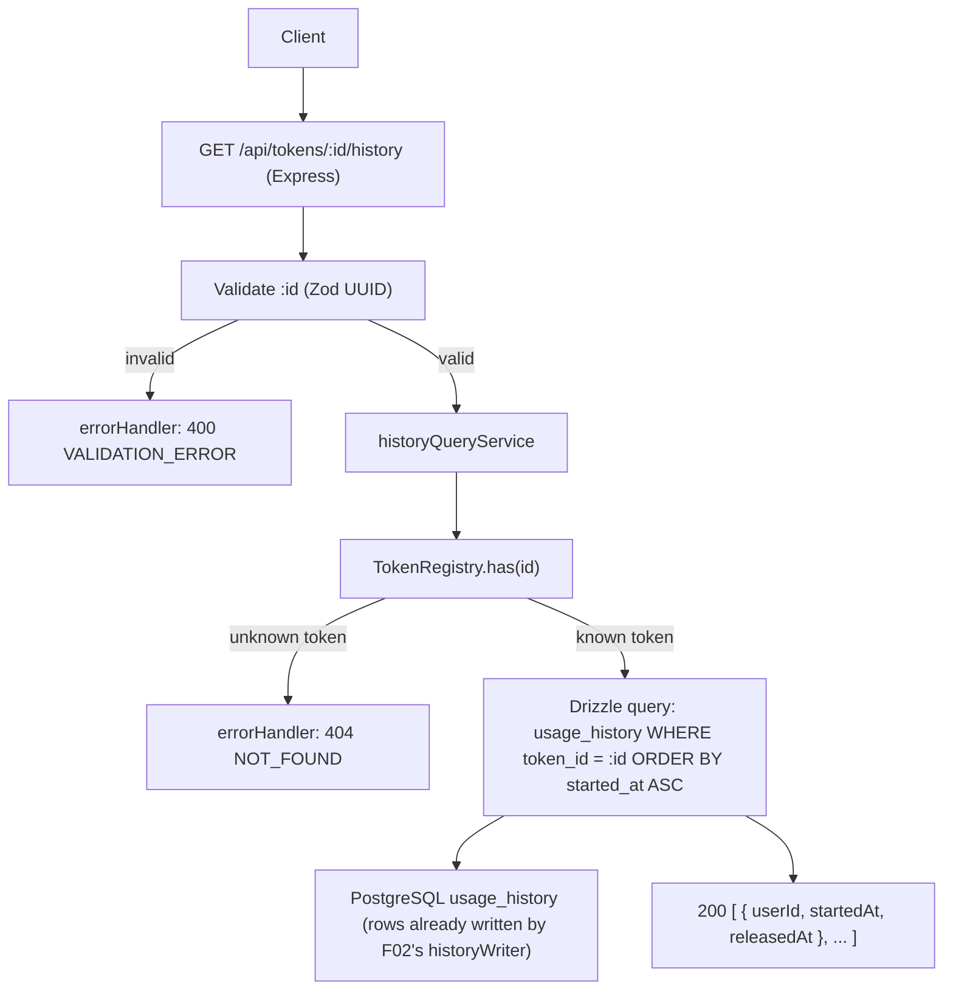

# Technical Spec: F05. Usage History Store and Query

## 1. Technical Overview

**What:** Add a single read endpoint — `GET /api/tokens/:id/history` — that returns the full chronological list of holders for one token: `[{ userId, startedAt, releasedAt }, ...]`, oldest entry first. An unknown token UUID returns HTTP 404; a known token that has never been assigned returns HTTP 200 with an empty array.

**Why:** The durable write path already exists. F02's spec explicitly assigned it the write side ("F02 owns the history writer... F05 adds only the read/query side"), and `src/services/historyWriter.ts` (built in F02) already opens a `usage_history` row on every assignment and closes+reopens rows on eviction, backed by a retry/backoff buffer so a DB outage never blocks or fails an assignment. The `usage_history` table itself was created by F01's migration (`drizzle/0000_init.sql`, `src/db/schema.ts`) — verified by reading both files directly. F05's entire job is therefore to expose that already-populated, already-durable data through a query, with the standard existence check and error conventions established by F01/F02.

**Scope:** This feature has no Core/Full Scope split in the PRD — the full feature as written is in scope, and it is READ-only. No new tables, no new columns, no changes to `historyWriter.ts`, and no changes to how F02 records events.

**Included:**
- `GET /api/tokens/:id/history` (mounted on the existing `/tokens` router) that validates `:id` as a UUID, confirms the token is one of the seeded 100, queries `usage_history` for that token ordered chronologically, and returns a bare JSON array of `{ userId, startedAt, releasedAt }`. (PRD *Consumes* F02 usage-history events; *Provides* usage history per token — used by F06.)
- Existence check against the registry's fixed token-identity set (`TokenRegistry.has`) to distinguish "unknown token UUID" (404) from "known token, no history" (200, empty array).
- Format validation of the `:id` path parameter (well-formed UUID) ahead of any lookup.

**Excluded (owned by other features / PRD Out of Scope):**
- Writing/closing `usage_history` rows — already built by F02 (`historyWriter.record`, transactional close-then-open on eviction, retry buffer). F05 never inserts, updates, or deletes rows.
- Pool/token listing (F04), token detail (F06 — consumes F05's query internally), clear-active (F07).
- Pagination, filtering, or sorting options on the history query (not requested by the PRD for F05; F04's Full Scope pagination is a separate, unrelated concern).
- Authentication, rate limiting, multi-instance/shared pool (all PRD *Out of Scope*).

**Decisions / Assumptions (Auto-Accept policy — Step 2 skipped):**
- **Verified F02 already owns the write path.** `src/services/historyWriter.ts` exports `createHistoryWriter`, wired into `assignmentService.assign` (`src/services/assignmentService.ts`): every assignment calls `historyWriter.record(...)`, which inserts an open row and, on eviction, closes the prior open row (`release_reason = 'eviction'`) and inserts the new one in one transaction. This matches F02's spec Decisions section verbatim ("F02 owns the history writer... F05 adds only the read/query side"). F05 adds no writer code.
- **Endpoint path** `GET /api/tokens/:id/history` (Auto-Accept: apply the recommendation) — this is not a new convention; it was already declared in F02 spec's Decisions section as the sibling path for the `/tokens` resource family, and `src/routes/index.ts`'s mount-point comment names "F05 history" as one of the routers attaching under `/tokens`.
- **Response shape** is a bare JSON array of `{ userId, startedAt, releasedAt }` per entry, camelCase (Auto-Accept: apply the recommendation, matching the codebase's established "bare success object/array, no `{status, data}` wrapper" convention from F01 `/health` and F02's assignment response). `tokenId` is intentionally omitted per entry — it is already the path parameter, and the PRD's *Provides* line for F05 lists exactly three fields per entry (user UUID, start timestamp, release timestamp). Field names mirror the Drizzle schema's TS property names (`usageHistory.userId`, `.startedAt`, `.releasedAt`), which already map the DB's snake_case columns (`user_id`, `started_at`, `released_at`) to camelCase — no additional translation layer is needed beyond selecting those three columns.
- **Chronological order** = ascending by `started_at` (oldest first). The PRD says "chronological list" without specifying direction; oldest-first is the natural reading and matches how F02's own integration test orders a token's rows (`orderBy(asc(usageHistory.startedAt))`).
- **Existence check via `TokenRegistry.has(id)`**, not a `tokens` table query (Auto-Accept: apply the recommendation — clear technical win, no conflicting pattern). The registry holds the complete, stable set of 100 seeded token UUIDs for the entire process lifetime (per F01), so an in-memory lookup is correct, avoids an extra DB round trip on every history read, and supports the PRD Objective of sub-200ms reads at a full pool.
- **`:id` UUID-format validation returns 400 `VALIDATION_ERROR`** before any lookup, reusing Zod as in F02's body validation (Auto-Accept: partial PRD spec — the PRD/acceptance criteria only state 404 for an unknown token UUID and say nothing about malformed input). This is an explicit assumption: a syntactically invalid UUID is treated as a client validation error (consistent with F02's `userId` handling), not folded into the 404 "not found" path.
- **No pagination/limit** on the returned array (Auto-Accept: no codebase pattern exists yet and the PRD does not request one for F05; F04's Full Scope pagination is unrelated and out of scope here).

## 2. Architecture Impact

**Affected components:**

| Area | Path | New/Modified | Role |
|------|------|--------------|------|
| History query service | `src/services/historyQueryService.ts` | New | Check token existence via the registry; query `usage_history` ordered chronologically; map rows to the response shape; throw `NotFoundError` for an unknown token. |
| Token resource router | `src/routes/tokens.ts` | Modified | Add `GET /:id/history`: validate `:id` (Zod UUID) → `ValidationError` on failure; delegate to the history query service; respond 200 with the array. |
| Base router | `src/routes/index.ts` | Modified | Construct the history query service (`{ registry, db }`) and pass it into `createTokensRouter` alongside the existing assignment service. |
| App factory | `src/app.ts` | Modified | Extend `AppDeps` with the `db: Database` handle so `createApiRouter` can build the history query service. |
| Entrypoint | `src/index.ts` | Modified | Pass `db.db` into `createApp` (already constructed for the history writer; now also threaded to the read side). |

**Data flow:**



## 3. Technical Decisions

| Decision | Chosen Approach | Alternative Considered | Trade-off |
|----------|------------------|-------------------------|-----------|
| Token-existence check | In-memory `TokenRegistry.has(id)` | Query the `tokens` table via Drizzle | Sub-millisecond, no extra DB round trip, always consistent with the process's fixed identity set; accepts the history route depending on the registry as well as the DB. |
| Endpoint path | `GET /api/tokens/:id/history` | `GET /api/history/:id`; merging into F06's detail endpoint | Matches the RESTful convention already declared in F02's spec and the `/tokens` router's stated mount point for F05; keeps F05 independently shippable ahead of F06, which will later consume this same query internally. |
| Response shape | Bare JSON array of `{ userId, startedAt, releasedAt }` | Wrapped object `{ tokenId, history: [...] }` | Matches the codebase's no-wrapper success convention (F01 `/health`, F02 assignment response); `tokenId` is already known from the URL and the PRD specifies exactly three fields per entry. |
| Ordering | `ORDER BY started_at ASC` (oldest first) | Newest-first (`DESC`) | "Chronological" reads naturally as oldest→newest; matches how F02's own test asserts a token's row order. |
| `:id` format validation | Zod `.uuid()` check before any lookup → 400 on malformed input | Skip format validation; let a malformed id fall through to a 404 | Consistent with F02's `userId` validation pattern — malformed input is a client error distinct from "well-formed but unknown"; explicit assumption since the PRD only mandates 404 for unknown UUIDs. |
| Data access | Drizzle query written inline in the service file | A dedicated repository/DAO layer | Matches the established pattern (`historyWriter.ts`, `assignmentService.ts`) of no separate repository layer; keeps the query colocated with the one place it's used. |

## 4. Component Overview

**Backend:**

| File Path | New/Modified | Purpose | Key Responsibilities |
|-----------|--------------|---------|----------------------|
| `src/services/historyQueryService.ts` | New | History query orchestration | `getHistory(tokenId)`: throw `NotFoundError` if `registry.has(tokenId)` is false; otherwise `db.select({ userId, startedAt, releasedAt }).from(usageHistory).where(eq(usageHistory.tokenId, tokenId)).orderBy(asc(usageHistory.startedAt))`; return the rows as-is (Drizzle already yields camelCase fields with `Date` values that `res.json` serializes to ISO 8601). |
| `src/routes/tokens.ts` | Modified | Token resource router | Add `GET /:id/history`: parse `:id` with `z.string().uuid()` → `ValidationError` on failure; call `historyQueryService.getHistory(id)`; respond `200` with the array; forward thrown errors (`NotFoundError`) to `next`. |
| `src/routes/index.ts` | Modified | Base router | Build `createHistoryQueryService({ registry, db })`; pass both services into `createTokensRouter({ assignmentService, historyQueryService })`. |
| `src/app.ts` | Modified | App factory | Add `db: Database` to `AppDeps`; forward it to `createApiRouter`. |
| `src/index.ts` | Modified | Startup orchestration | Pass the already-constructed `db.db` handle into `createApp` (no new DB connection — reuses the one used for migrations/pool init/history writer). |

**Database:**

| Migration File | Tables Affected | Operation | Notes |
|-----------------|------------------|-----------|-------|
| — (none) | `usage_history` | No schema change | F05 introduces **no** migration. It reads the `usage_history` table created by F01 (`drizzle/0000_init.sql`) and populated by F02's `historyWriter`, using the existing `ix_usage_history_token_started` index for the ordered per-token read. |

## 5. API Contracts

**Endpoint: Token Usage History**
- **Method:** GET
- **Path:** `/api/tokens/:id/history` (under `API_BASE_PATH`; default `/api`)
- **Authentication:** None (auth is PRD *Out of Scope*)

**Request:**

| Field | Location | Type | Required | Validation | Description |
|-------|----------|------|----------|------------|--------------|
| `id` | path | `string` (uuid) | Yes | RFC 4122 UUID (`z.string().uuid()`) | The token UUID to fetch history for. |

**Request Example:**
```
GET /api/tokens/1b4e28ba-2fa1-11d2-883f-0016d3cca427/history
```

**Response (Success — 200):**

| Field | Type | Description |
|-------|------|-------------|
| *(array element)* `userId` | `uuid` | The user that held the token for this entry. |
| *(array element)* `startedAt` | `string` (ISO 8601) | When this hold began. |
| *(array element)* `releasedAt` | `string` (ISO 8601) \| `null` | When this hold ended; `null` means the entry is still open (currently active). |

The response body is the bare array itself — not wrapped in an envelope — ordered oldest-first.

**Response Example — token with history:**
```json
[
  {
    "userId": "550e8400-e29b-41d4-a716-446655440000",
    "startedAt": "2026-07-08T12:00:00.000Z",
    "releasedAt": "2026-07-08T12:02:00.000Z"
  },
  {
    "userId": "6ba7b810-9dad-11d1-80b4-00c04fd430c8",
    "startedAt": "2026-07-08T12:02:00.000Z",
    "releasedAt": null
  }
]
```

**Response Example — token never assigned (200, not an error):**
```json
[]
```

**Response — Unknown token UUID (404):**
```json
{
  "status": "error",
  "error": {
    "code": "NOT_FOUND",
    "message": "Token not found: 1b4e28ba-2fa1-11d2-883f-0016d3cca427"
  }
}
```

**Error Codes:**

| Code | HTTP Status | Description |
|------|-------------|--------------|
| `VALIDATION_ERROR` | 400 | `:id` is not a well-formed UUID. |
| `NOT_FOUND` | 404 | `:id` is a well-formed UUID but not one of the 100 seeded tokens. |

**Error Example (malformed id):**
```json
{
  "status": "error",
  "error": {
    "code": "VALIDATION_ERROR",
    "message": "id must be a valid UUID"
  }
}
```

> Note: an empty history array is a **success** response (200), not an error — it means the token exists but has never been assigned (PRD *Error Handling*: "Query for a token with no history → HTTP 200 with an empty list").

## 6. Data Model

F05 adds **no** tables, columns, indexes, or migrations. It only reads the `usage_history` table created by F01 and populated by F02. Documented here for reference since F05's correctness depends entirely on reading it correctly.

**Table: `usage_history`** (existing, created in `drizzle/0000_init.sql`):

| Column | Type | Nullable | Default | Description |
|--------|------|----------|---------|-------------|
| `id` | `uuid` | No | `gen_random_uuid()` | History entry primary key (not returned by F05's response). |
| `token_id` | `uuid` | No | — | The token this entry belongs to; F05 filters on this. |
| `user_id` | `uuid` | No | — | Returned as `userId`. |
| `started_at` | `timestamptz` | No | — | Returned as `startedAt`; F05 orders ascending on this column. |
| `released_at` | `timestamptz` | Yes | `null` | Returned as `releasedAt`; `null` = still open. |
| `release_reason` | `varchar(32)` | Yes | `null` | Not returned by F05's response (internal/audit detail: `ttl`, `eviction`, `clear`, `startup_reconciliation`). |

**Indexes (existing, used by F05's query):**

| Index Name | Columns | Type | Purpose |
|------------|---------|------|---------|
| `ix_usage_history_token_id` | `token_id` | btree | Supports the `WHERE token_id = :id` filter. |
| `ix_usage_history_token_started` | `token_id, started_at` | btree | Directly satisfies F05's filter + `ORDER BY started_at ASC` as an index-only scan pattern. |
| `ix_usage_history_open` | `token_id` WHERE `released_at IS NULL` | partial btree | Not used by F05 (used by writers/reconciliation); listed for completeness. |

**Constraints (existing):**

| Constraint | Type | Definition | Purpose |
|------------|------|------------|---------|
| `fk_usage_history_token` (`usage_history_token_id_tokens_id_fk`) | FOREIGN KEY | `token_id REFERENCES tokens(id)` | Guarantees every history row references a real pool token — F05's registry-based existence check and this FK agree by construction. |
| `chk_release_after_start` | CHECK | `released_at IS NULL OR released_at >= started_at` | Guarantees `releasedAt` is never before `startedAt` in F05's response. |

**No schema changes — the table, its indexes, and its constraints already exist exactly as created by F01's migration; F05 performs read-only `SELECT` statements against it.**

## 7. Testing Strategy

**Test File Structure:**

| Test File | Test Type | Target | Coverage Goal |
|-----------|-----------|--------|----------------|
| `tests/unit/historyQueryService.test.ts` | Unit | `src/services/historyQueryService` | 90% |
| `tests/integration/history.test.ts` | Integration | `GET /api/tokens/:id/history` (supertest + real Postgres) | 80% |

**`tests/unit/historyQueryService.test.ts`:**

| Test Function | Description | Assertions |
|----------------|--------------|-------------|
| `returns entries ordered chronologically` | Seed `usage_history` rows out of insertion order for one token | Result array is ascending by `startedAt`; oldest entry first. |
| `returns an empty array for a known token with no history` | `registry.has` true, no matching rows | Returns `[]`; no error thrown. |
| `maps rows to the { userId, startedAt, releasedAt } shape` | One open row, one closed row | Each element has exactly `userId`, `startedAt`, `releasedAt`; the closed entry's `releasedAt` is a `Date`, the open entry's is `null`; no `id`/`tokenId`/`releaseReason` leak into the shape. |
| `throws NotFoundError for an unknown token id` | `registry.has` false | `getHistory` rejects with `NotFoundError`; no DB query is issued. |

**`tests/integration/history.test.ts` (acceptance — PRD Section 9 F05):**

| Test Function | Description | Assertions |
|----------------|--------------|-------------|
| `returns the full chronological history for a token` | Assign a token, evict it via a full-pool overflow, assign it again | 200; array has one closed entry (`releaseReason`-driven `releasedAt` set, oldest first) followed by the current open entry (`releasedAt: null`); `userId`/`startedAt` match the assignments made. |
| `returns 200 with an empty list for a token that has never been assigned` | Fresh pool, pick a seeded token never assigned | 200; body is `[]`. |
| `returns 404 for an unknown token UUID` | GET with a random UUID not in the seeded pool | 404; `error.code === "NOT_FOUND"`. |
| `returns 400 for a malformed id` | GET with `:id = "not-a-uuid"` | 400; `error.code === "VALIDATION_ERROR"`; no DB query attempted. |
| `history persists across a service restart` | Assign a token, shut down and restart the service against the same DB, GET its history | 200; the same entries are returned after restart (durability, matching F02's already-durable writes). |

**Cross-Feature Integration (PRD Section 9 — criteria referencing F05):**

| Test Function | Description | Assertions |
|----------------|--------------|-------------|
| `every F02 assignment event is queryable via F05's history endpoint (F02↔F05)` | Perform N assignments (including some that evict) via `POST /api/tokens`, then `GET` each affected token's history | Exactly one entry per assignment across all queried tokens (0 missing, 0 duplicated), matching the PRD Objective "every assignment produces exactly 1 durable history record." |
| `an eviction's close is visible in the history query (F02↔F05)` | Fill the pool, trigger an eviction, then GET the evicted token's history | The closed entry shows a non-null `releasedAt`; the new holder's entry shows `releasedAt: null`; both appear in the correct chronological order. |
