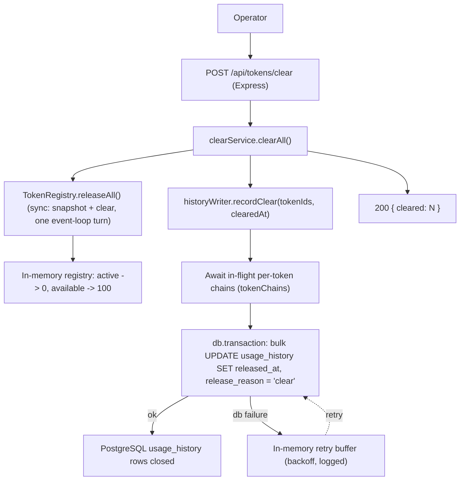

# Technical Spec: F07. Clear Active Tokens

## 1. Technical Overview

**What:** Add a single administrative endpoint — `POST /api/tokens/clear` — that releases **every** currently active token back to `available` in one atomic operation and returns `{ cleared: N }`, where `N` is the number of tokens that were active at the instant of the clear. Each cleared token's open `usage_history` row (F01 schema, opened by F02) is closed with a release timestamp and `release_reason = 'clear'` (the enum value already reserved in F01's `ReleaseReason`). No tokens are created or destroyed; the pool stays at exactly 100 tokens, all available, once the operation completes.

**Why:** F07 is the operator's incident-response lever: when the pool is stuck (e.g. many stale/misbehaving holders), a single call resets it without waiting out TTLs (F03) one by one. The interesting engineering problem is not the release itself — `TokenRegistry` already has an idempotent, synchronous `release(tokenId)` — but doing it for an unbounded set of tokens **atomically** on both sides of the system: the in-memory registry (which must reflect a consistent point-in-time snapshot, per PRD *Error Handling*: "assignments in flight during the clear are operated against an atomic snapshot") and the durable history store (per PRD *Error Handling*: "failure partway through → all-or-nothing"). This spec follows the two atomicity mechanisms the codebase already established in F02: a fully synchronous registry mutation (no `await`) for the in-memory side, and a `db.transaction(...)` for the durable side.

**Scope:** F07 has no Core/Full Scope split in the PRD; the scope below is the complete feature as specified.

**Included:**
- `POST /api/tokens/clear` route (mounted on the existing F02 tokens router) that takes no request body and returns `{ cleared: N }` with HTTP 200.
- A new synchronous `TokenRegistry.releaseAll()` method: one pass over the registry, in a single event-loop turn, that captures every active token's holder info, clears it, and returns the list of released `{ tokenId, info }` pairs — the same single-turn atomicity guarantee `acquire()` already relies on for the 100-cap.
- A new `historyWriter.recordClear(tokenIds, clearedAt)` method: closes the open `usage_history` row for every given token in **one** `db.transaction`, `release_reason = 'clear'`; coordinates with the existing per-token write-ordering chain (`tokenChains`) before closing, so an in-flight eviction/TTL write for one of the cleared tokens cannot land after the clear and reopen or duplicate that token's history; never throws to the caller (buffers and retries on failure, mirroring the existing mechanism).
- A new `clearService` that orchestrates: call `registry.releaseAll()` synchronously, hand the result to `historyWriter.recordClear` (not on the response's critical path), and respond with `{ cleared: N }` where `N` is the registry's count of released tokens.
- Route placement: `/clear` is registered as a literal path segment on the tokens router, ahead of any future parameterized route (e.g. a `:id`-shaped route another Wave-3 sibling might add), so Express can never match a request for `/clear` against a param route.

**Excluded (owned by other features / PRD Out of Scope):**
- Listing (F04), history query (F05), token detail (F06) — F07 only writes, it does not expose read views.
- Manual release of a single token, keep-alive/renewal, per-request TTLs, multi-instance pools, auth/rate limiting (all PRD *Out of Scope*).
- Any change to `tokens`/`usage_history` schema — F07 reuses F01's tables and F02's write conventions unmodified.

**Decisions / Assumptions (Auto-Accept defaults applied — see also §3 Technical Decisions):**
- **Route `POST /api/tokens/clear`** (Auto-Accept: apply the codebase's own recommendation) — F02's spec already records this exact path as the intended convention for the sibling family; adopting it verbatim avoids inventing a second convention.
- **Coordination risk (Auto-Accept: document explicitly)** — F03/F04/F05 are being spec'd in parallel by sibling agents in the same wave. None of them are expected to add a `POST /api/tokens/:id`-style route per the PRD (their surfaces are read-only GETs and a background sweeper), but because Express matches routes in registration order, `/clear` **must** be registered as a literal segment before any future param route is added to the tokens router, or a POST to `/clear` could be misrouted as `:id = "clear"`. Documented here so implementation order is explicit.
- **`TokenRegistry.releaseAll()` over looping `release()`** (Auto-Accept: apply the clear recommendation) — a dedicated synchronous bulk method structurally guarantees the atomic-snapshot requirement and returns exactly the `{tokenId, info}` pairs history needs in one pass, rather than requiring the caller to loop `release()` and separately track what was released.
- **Registry commits unconditionally; DB failure is retried/logged, not surfaced** (Auto-Accept: reasoned decision, F02 precedent) — see the dedicated Technical Decisions row below.
- **No new error code** — normal operation never fails (empty active set → `{ cleared: 0 }` is success, not an error, per PRD). The only failure surfaced to the client is an unexpected internal error, which falls under F01's existing `INTERNAL_ERROR` 500 envelope.

## 2. Architecture Impact

**Affected components:**

| Area | Path | New/Modified | Role |
|------|------|--------------|------|
| Clear route | `src/routes/tokens.ts` | Modified | Add `POST /clear` — no body, calls the clear service, returns `{ cleared }`. |
| Clear service | `src/services/clearService.ts` | New | Orchestrate `registry.releaseAll()` then `historyWriter.recordClear()`; return `{ cleared: N }` regardless of the durable write's outcome. |
| Registry | `src/registry/tokenRegistry.ts` | Modified | Add synchronous `releaseAll()`: bulk-release every active token in one event-loop turn; return the released `{ tokenId, info }` list. |
| History writer | `src/services/historyWriter.ts` | Modified | Add `recordClear(tokenIds, clearedAt)`: transactional bulk close of open rows, coordinated with the existing per-token `tokenChains`; buffers on failure via the existing retry mechanism. |
| Base router | `src/routes/index.ts` | Modified (comment only) | Update the F02-era "F07 clear later" placeholder comment; no new dependency wiring — `/clear` reuses the already-injected `registry`/`historyWriter`. |

**Data flow:**



## 3. Technical Decisions

| Decision | Chosen Approach | Alternative Considered | Trade-off |
|----------|------------------|-------------------------|-----------|
| Endpoint path & method | `POST /api/tokens/clear`, registered as a literal segment ahead of any future `:id`-pattern route | `DELETE /api/tokens` (bulk-delete semantics); `POST /api/tokens/reset` | Matches the convention F02's spec already records for the sibling family; avoids implying tokens are destroyed (`DELETE`) when they are only toggled; accepts an explicit coordination burden — the literal `/clear` segment must stay ahead of any sibling `:id` route in registration order. |
| Registry-level atomicity | New synchronous `TokenRegistry.releaseAll()` — one pass, no `await`, mirroring `acquire()`'s single-event-loop-turn guarantee | Loop external calls to the existing `release(tokenId)` per active token | Makes the "atomic snapshot" requirement (PRD: in-flight assignments see a consistent snapshot) structurally guaranteed rather than caller-enforced, and returns the exact `{tokenId, info}` set history needs in one pass; accepts a new method alongside `release`/`acquire`. |
| DB-side atomicity | Bulk `UPDATE usage_history ... WHERE token_id = ANY(...) AND released_at IS NULL`, wrapped in `db.transaction()`, reusing the pattern from `historyWriter.persist()`'s eviction path | N independent per-token UPDATE statements | A single multi-row UPDATE is already atomic in Postgres, but the explicit `db.transaction()` wrapper matches F01/F02 precedent of making a PRD-mandated atomicity requirement self-documenting in code, and leaves room to chunk a very large `IN`/`ANY` list later without losing the guarantee; accepts a transaction wrapper that is technically redundant for a single statement today. |
| Interaction with the per-token write chain | `recordClear` first awaits each affected token's existing entry in `historyWriter`'s `tokenChains` map (if any present), then performs the bulk close | Run the bulk close independently of `tokenChains` | Prevents a stale in-flight eviction/TTL write for one of the cleared tokens from committing *after* the clear's close and silently reopening or duplicating that token's history; accepts a small added latency on `recordClear`, bounded by the in-flight writes' own latency (the same cost the codebase already pays for per-token ordering in F02). |
| Registry-vs-DB failure handling ("all-or-nothing") | Registry clear commits unconditionally, and `{ cleared: N }` is derived from the registry result; the DB bulk-close transaction is genuinely all-or-nothing **at the DB layer** (all matched rows close, or none do), and on transaction failure the whole batch is logged and handed to the existing retry/backoff buffer rather than surfaced to the client | True two-phase commit: attempt the DB transaction first, only mutate the registry / return success if it commits, and return an HTTP 5xx on DB failure without touching the registry | Mirrors F02's established precedent ("history-write failure during assignment never blocks the primary operation") and keeps clear-active usable as an incident tool even during a DB outage — making the one operation meant to rescue an incident depend on DB health would defeat its purpose. The tokens are, in fact, released the instant the registry commits, so treating that as reversible would contradict reality. Accepts that the PRD's "all-or-nothing... with an error returned" is interpreted as the DB transaction's own internal guarantee (no partial batch) rather than a client-visible rollback of the in-memory release; a persistent DB outage means history can lag the true (already-active) state until a buffered retry lands — bounded and logged by the same retry policy already trusted for F02. |
| Response shape | Bare `{ cleared: number }`, HTTP 200, no wrapper | `{ status: "success", data: { cleared } }` envelope | Matches the bare-object convention F02 already established (`{ tokenId, userId, activatedAt }`); accepts the project-wide asymmetry between bare success bodies and the `{ status, error }` error envelope (already true since F01). |

## 4. Component Overview

**Backend:**

| File Path | New/Modified | Purpose | Key Responsibilities |
|-----------|--------------|---------|----------------------|
| `src/registry/tokenRegistry.ts` | Modified | Bulk synchronous release | Add `releaseAll(): ReleasedHold[]` — single synchronous pass over all entries; for each currently active token, capture its `ActiveInfo`, set it back to available, decrement `activeCount`; return the full list of `{ tokenId, info }` released. Zero-`await` body, same single-turn guarantee as `acquire()`. Idempotent-safe: a second call with nothing active returns `[]`. |
| `src/services/historyWriter.ts` | Modified | Bulk durable close | Add `recordClear(tokenIds: string[], clearedAt: Date): Promise<void>` — no-ops on an empty list; otherwise awaits any live entries in `tokenChains` for the given tokens, then runs one `db.transaction` that closes every matching open row (`released_at = clearedAt`, `release_reason = ReleaseReason.CLEAR`); on failure, logs and enqueues the whole batch into the existing retry buffer (same backoff/attempts policy as `record`); never rejects. |
| `src/services/clearService.ts` | New | Clear orchestration | `createClearService({ registry, historyWriter })` exposing `clearAll(): Promise<{ cleared: number }>`: call `registry.releaseAll()`, derive `cleared` from its length, fire-and-track `historyWriter.recordClear(...)` without blocking the response, and return `{ cleared }`. |
| `src/routes/tokens.ts` | Modified | Clear endpoint | Add `router.post("/clear", ...)` above any future parameterized route; no request body validation needed (no input); calls `clearService.clearAll()` and responds `200 { cleared }`. |
| `src/routes/index.ts` | Modified (comment only) | Base router | Update the F02-era placeholder comment ("F04 listing, F05 history, F06 detail, F07 clear later") now that clear is wired; `createApiRouter`'s dependency shape (`registry`, `historyWriter`) is unchanged — no new deps to thread. |

**Database:**

| Migration File | Tables Affected | Operation | Notes |
|-----------------|------------------|-----------|-------|
| — (none) | `usage_history` | No schema change | F07 introduces **no** migration. It reuses the `usage_history` table and the `ReleaseReason.CLEAR = "clear"` value already reserved in F01's schema (`src/db/schema.ts`). |

## 5. API Contracts

**Endpoint: Clear Active Tokens**
- **Method:** POST
- **Path:** `/api/tokens/clear` (under `API_BASE_PATH`; default `/api`)
- **Authentication:** None (auth is PRD *Out of Scope*)

**Request:** No parameters, no body.

**Response (Success — 200):**

| Field | Type | Description |
|-------|------|--------------|
| `cleared` | `integer` | Count of tokens that were active and are now released to available. `0` when nothing was active (still a success, not an error). |

**Response Example — tokens were active:**
```json
{
  "cleared": 37
}
```

**Response Example — nothing active:**
```json
{
  "cleared": 0
}
```

**Error Codes:**

| Code | HTTP Status | Description |
|------|-------------|--------------|
| `INTERNAL_ERROR` | 500 | An unexpected internal failure during the synchronous registry step (existing F01 central error middleware; not a normal operational path). A durable-store (DB) failure during the close is **not** surfaced here — see Technical Decisions: it is logged and retried in the background while the endpoint still returns 200. |

**Error Example:**
```json
{
  "status": "error",
  "error": {
    "code": "INTERNAL_ERROR",
    "message": "Internal server error"
  }
}
```

> Note: there is no "nothing to clear" error and no partial-clear response shape — the operation either releases every currently active token (reported as `cleared`) or, in the impossible-in-practice case of a synchronous registry defect, fails as a 500 before any state changes (the registry mutation and the response are the same synchronous step, so a thrown error there implies no tokens were released).

## 6. Data Model

F07 adds **no** tables, columns, indexes, or migrations. It writes to the `usage_history` table defined by F01 (see F01 spec §6), closing rows opened by F02 (or left open across an eviction/TTL race, per the Technical Decisions coordination with `tokenChains`), using the `ReleaseReason.CLEAR` value already reserved in F01's schema (`src/db/schema.ts`) — **no migration needed**.

**Rows F07 mutates in `usage_history`:**

| Operation | When | Effect |
|-----------|------|--------|
| Bulk UPDATE close | Every `POST /api/tokens/clear` call where at least one token was active | For every token returned by `registry.releaseAll()`, its single open row (`released_at IS NULL`) is closed: `released_at = clearedAt`, `release_reason = 'clear'`. |

**Write pattern (illustrative SQL, one transaction):**
```sql
BEGIN;
  UPDATE usage_history
     SET released_at = $clearedAt, release_reason = 'clear'
   WHERE token_id = ANY($tokenIds) AND released_at IS NULL;
COMMIT;
```

**Invariants preserved:** the pool stays exactly 100 tokens (F07 only toggles state via the registry, never inserts into or deletes from `tokens`); `available + active == 100` after the clear completes (`active == 0`, `available == 100`); every cleared token's history shows a closed row with `release_reason = 'clear'`, satisfying "history is preserved" (PRD *Capabilities*).

## 7. Testing Strategy

**Test File Structure:**

| Test File | Test Type | Target | Coverage Goal |
|-----------|-----------|--------|-----------------|
| `tests/unit/tokenRegistry.releaseAll.test.ts` | Unit | `TokenRegistry.releaseAll` | 90% |
| `tests/unit/historyWriter.clear.test.ts` | Unit | `historyWriter.recordClear` | 90% |
| `tests/integration/clear.test.ts` | Integration | `POST /api/tokens/clear` + `usage_history` (supertest + real Postgres) | 80% |

**`tests/unit/tokenRegistry.releaseAll.test.ts`:**

| Test Function | Description | Assertions |
|-----------------|--------------|--------------|
| `releases all active tokens back to available` | Registry with several active tokens, call `releaseAll()` | `active === 0`; `available === size`; returned list length equals the prior active count. |
| `returns cleared === 0 when nothing is active` | Fresh registry, `releaseAll()` | Returns `[]`; no state change; `available` unchanged. |
| `returns each released token's prior holder info` | Active tokens with distinct users | Each returned entry has the correct `tokenId` and the exact `ActiveInfo` (`userId`, `activatedAt`, `activatedAtMonotonic`) it held before release. |
| `leaves the pool at exactly size tokens, all available` | After `releaseAll()` on a partially/fully active pool | `available + active === size` holds; `size` itself is unchanged (no token created/destroyed). |
| `is idempotent across repeated calls` | Call `releaseAll()` twice back to back | Second call returns `[]` and performs no mutation. |

**`tests/unit/historyWriter.clear.test.ts`:**

| Test Function | Description | Assertions |
|-----------------|--------------|--------------|
| `closes all open rows for the given tokens in one transaction` | N tokens each with an open row, `recordClear(tokenIds, clearedAt)` | Exactly one `db.transaction` call; N rows updated with `releaseReason: "clear"`, `releasedAt: clearedAt`. |
| `no-ops on an empty token list` | `recordClear([], clearedAt)` | Resolves without starting a transaction. |
| `waits for an in-flight per-token write before closing` | A pending `tokenChains` entry exists for one of the tokens (e.g. a slow eviction write in flight) when `recordClear` is called for that token | The in-flight write completes and is observed (via call order) strictly before the clear's bulk close executes for that token. |
| `never throws on a db failure; buffers the whole batch for retry` | Injected transaction failure | `recordClear` resolves; an error is logged; the batch is retried later and eventually persisted (mirrors `historyWriter.test.ts`'s existing retry assertions). |
| `a mid-batch failure updates none (transactional all-or-nothing)` | Forced failure mid-transaction | No rows are updated on the failed attempt (consistent with the codebase's `FakeDb.transaction` semantics: a failed transaction records nothing). |

**`tests/integration/clear.test.ts` (acceptance — PRD Section 9 F07):**

| Test Function | Description | Assertions |
|-----------------|--------------|--------------|
| `clears all active tokens and returns the count` | Assign K tokens (F02), then `POST /api/tokens/clear` | 200; body `{ cleared: K }`; `/health` afterward shows `active: 0`, `available: 100`. |
| `returns cleared: 0 and succeeds when nothing is active` | Fresh pool, `POST /api/tokens/clear` | 200; body `{ cleared: 0 }`; no state change. |
| `preserves history: each cleared token's row is closed with a release timestamp and reason` | Assign then clear | Each cleared token's `usage_history` row has `releasedAt` set and `releaseReason === "clear"`. |
| `does not create or destroy tokens` | Clear at any active count | `tokens` table row count stays 100; `registry.size` unchanged before/after. |
| `mounts /clear as a literal segment, not shadowed by a param route` | `POST /api/tokens/clear` alongside existing `POST /api/tokens` (F02) | The clear handler responds (not the assignment handler); path resolution is unambiguous. |

**Cross-Feature Integration (PRD Section 9 — criteria referencing F07):**

| Test Function | Description | Assertions |
|-----------------|--------------|--------------|
| `clear-active transitions every active token identified via F01 registry and F02 assignments back to available (F01↔F02↔F07)` | Assign multiple tokens via F02, confirm active state via the F01 registry/`/health`, then clear | Every token that was active (per the registry) is available afterward; none of the other (never-assigned) tokens are affected; `available + active === 100` throughout. |
| `assignments in flight during the clear observe a consistent atomic snapshot` | Fire concurrent `POST /api/tokens` (F02) and `POST /api/tokens/clear` via `Promise.all` | At every point, `available + active === 100`; each token is either included in the clear's snapshot (and ends available, possibly reassigned by a request that arrives strictly after) or excluded (and remains correctly active/available) — no token is left in a corrupted or double-active state. |

> Integration tests run against a real PostgreSQL (disposable test database/container, via `tests/helpers/db.ts`) so the bulk-close transaction and the `tokens ⇄ usage_history` foreign key are exercised end-to-end.
