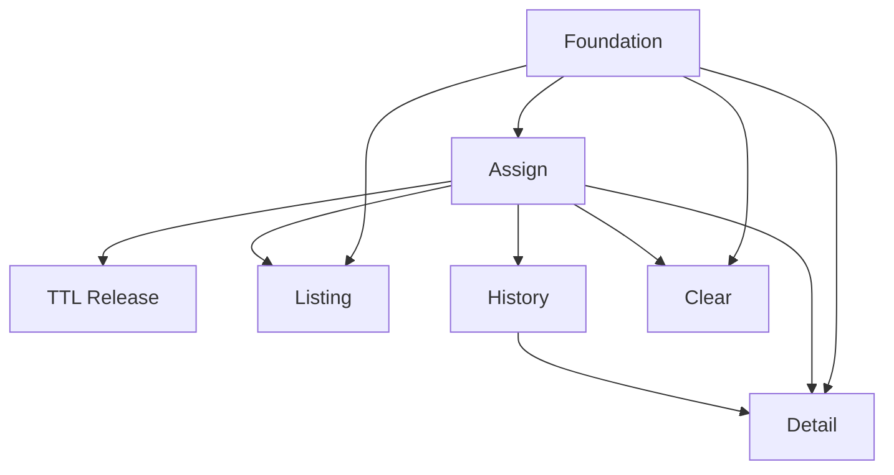

# Token Management Service

## 1. Executive Summary

Token Management Service is a standalone Node.js HTTP/JSON backend that governs concurrent access to a limited resource through a fixed pool of exactly 100 pre-generated tokens. Each token is a UUID that lives in one of two states — **available** or **active** — and is never created or destroyed at runtime; it only toggles between those states. Client applications call the service to obtain a token before performing a protected operation, and the service guarantees that no more than 100 tokens are active at any instant.

The product is built for backend teams, platform/SRE operators, and support analysts who need a single authority to cap concurrency across many distributed clients, without each client having to track or clean up its own allocations. The core value is a **robust, centralized concurrency limiter with automatic reclamation**: callers get a token, use it, and never have to remember to return it — the service reclaims tokens on its own.

At a high level, the service seeds 100 available tokens on startup. A client registers utilization by sending a user UUID; the service assigns an available token, records who holds it and when, and returns the token UUID. Two automatic rules keep the pool healthy: any token that has been active for 2 minutes is released back to available, and if all 100 tokens are active when a new request arrives, the **oldest active token is evicted** to make room — so an acquire request never fails for lack of capacity. A durable usage history captures every user that has ever held each token, and read endpoints expose pool state, per-token detail, and history. An administrative endpoint clears all active tokens at once.

## 2. Problem and Opportunity

### The Problem

**Uncontrolled concurrency against a limited resource**
- Without a single authority, multiple clients can collectively exceed a resource's safe concurrency ceiling, causing overload, throttling, or outages.
- Per-client limits do not compose: five clients each allowing 30 in-flight operations do not add up to a global cap of 100 — they add up to 150.
- Tuning each client independently is fragile and drifts out of sync over time.

**Leaked and orphaned allocations**
- Clients crash, time out, or simply forget to release what they took, so allocations accumulate and starve everyone else.
- Manual cleanup is reactive and error-prone, and usually happens only after capacity is already exhausted.

**No visibility into who holds what**
- Operators cannot answer "which users are consuming capacity right now?" without instrumenting every client.
- There is no audit trail of which users held a given slot historically, making incident forensics guesswork.

**Starvation and hard blocking at the ceiling**
- When the pool is exhausted, naive systems either block callers indefinitely or reject them outright, turning a full pool into a denial of service.

### The Opportunity

Token Management Service resolves each pain with a specific mechanism:

- **Global cap inconsistency → a single 100-token authority.** The service (F01 pool + F02 assignment) is the one place the limit is enforced, so the global total is always correct regardless of how many clients connect.
- **Leaked allocations and starvation → automatic reclamation.** TTL release (F03) reclaims any token after 2 minutes, and oldest-first eviction (F02) frees capacity on demand, so a token can never stay leaked and no caller is ever permanently blocked.
- **Lack of visibility → first-class observability.** Pool listing (F04), token detail (F06), and durable usage history (F05) answer "who holds what, and who held it before" directly.
- **Operational lock-ups → a safe reset.** Clear-active (F07) lets operators reclaim the whole pool in one atomic action during an incident.

The differentiator is that **assignment never fails**: instead of rejecting or blocking a caller when the pool is full, the service evicts the oldest holder so the newest caller always gets a token, trading strict fairness for guaranteed availability — backed by a durable, per-token audit trail.

## 3. Target Audience

### Primary Users

**Client Application Developer**
- Integrates the assignment endpoint into services that must respect the shared concurrency cap.
- Sends a user UUID, receives a token, and proceeds with the protected operation.
- Wants simple, predictable JSON responses and to never be hard-blocked when capacity is tight.

**Platform / SRE Operator**
- Monitors pool saturation and identifies which users are holding tokens during contention.
- Uses listing and detail endpoints to diagnose hot spots and uses clear-active to reset the pool during incidents.
- Values deterministic behavior, fast reads, and a safe bulk-reset that cannot corrupt the pool.

**Support / Audit Analyst**
- Investigates historical usage: which users held a specific token and when.
- Relies on per-token history queries that survive service restarts.
- Values a complete, chronological, durable record.

### Behavioral Profile

- All personas are technical and API-first; they interact over HTTP/JSON, not a UI.
- They expect deterministic, well-defined responses and clear status codes for both success and failure.
- They prioritize correctness of the 100-token invariant and low-latency reads over rich formatting.

## 4. Objectives

**Enforce a hard concurrency ceiling**
- Metric: 0 observed instances of more than 100 active tokens under a load test issuing 500 simultaneous assignment requests.
- Condition: measured continuously during and after the concurrent burst.

**Guarantee acquire availability**
- Metric: 100% of assignment requests return a token (never a "pool full" rejection) across all functional and load tests.
- Condition: verified even when the pool starts fully saturated at 100 active tokens.

**Reclaim tokens automatically within SLA**
- Metric: 100% of tokens active for 2 minutes are released to available within 5 seconds of the 120-second threshold.
- Condition: measured with tokens held continuously past their TTL.

**Provide complete observability and audit**
- Metric: every assignment produces exactly 1 durable history record (0 missing, 0 duplicated); listing and detail reads respond in under 200 ms at a full pool of 100 tokens.
- Condition: history records survive a service restart.

**Preserve pool integrity**
- Metric: the total token count stays exactly 100 across any sequence of operations; 0 tokens are created or destroyed at runtime.
- Condition: verified after assignment, eviction, TTL release, and clear-active operations.

## 5. User Stories

### F01. Service Foundation and Token Pool Initialization
- As the system, I want to seed exactly 100 pre-generated UUID tokens in the available state on startup so that a fixed pool is ready before any request arrives.
- As the system, I want to keep the token count fixed at 100 for the service's lifetime so that tokens are only toggled between available and active, never created or destroyed.
- As an operator, I want a health endpoint that reports available and active counts so that I can confirm the service booted with a full pool.

### F02. Token Assignment and Overflow Eviction
- As a client developer, I want to register utilization by sending a user UUID so that I receive an available token associated with that user.
- As a client developer, I want the response to include the token UUID and the user UUID so that I can reference the assignment afterward.
- As the system, I want to evict the oldest active token when all 100 are in use so that a new assignment request always succeeds.
- As the system, I want to reject a request with a missing or malformed user UUID so that only valid assignments are recorded.

### F03. Automatic TTL Release
- As the system, I want to automatically release any token that has been active for 2 minutes so that leaked or forgotten allocations cannot starve the pool.
- As the system, I want a released token to return to the available list immediately so that it can be reassigned to another user.

### F04. Token and Pool Listing
- As an operator, I want to list all tokens with their current state so that I can see pool saturation at a glance.
- As an operator, I want each active token to show its current user and remaining time so that I can identify who is consuming capacity and for how long.

### F05. Usage History Store and Query
- As an audit analyst, I want every assignment to be recorded durably so that the history survives service restarts.
- As an audit analyst, I want to query the full list of users that have held a specific token so that I can reconstruct its usage over time.

### F06. Token Detail Query
- As an operator, I want to inspect a single token to see its state, current holder, and remaining time so that I can diagnose a specific allocation.
- As an audit analyst, I want the same detail view to include the token's usage history so that I can see current and past holders in one place.

### F07. Clear Active Tokens
- As an operator, I want to release all active tokens at once so that I can reset the pool during an incident.
- As an operator, I want the response to confirm how many tokens were cleared so that I know the reset took effect.

## 6. Functionalities

### F01. Service Foundation and Token Pool Initialization

**Provides:**
- Token registry — the fixed pool of exactly 100 tokens, each with a token UUID and a state of available or active (used by F02, F04, F06, F07)

**Capabilities:**
- Bootstraps a Node.js HTTP/JSON service exposing all routes under a single base path and a `GET /health` endpoint.
- Seeds exactly 100 pre-generated UUID (v4) tokens at startup, all in the **available** state.
- Fixed pool: no endpoint or operation can create or destroy a token — the count is invariant at 100 for the process lifetime.
- Initializes the in-memory active-state registry and the durable history store before accepting traffic.
- Configuration values with defaults: pool size (default 100), TTL (default 120 seconds), and HTTP port.

**Experience:**
- On start, the service generates or loads 100 unique token UUIDs, marks all available, and logs `Token pool initialized: 100 available`.
- `GET /health` returns HTTP 200 with `{ status: "ok", available, active }` where `available + active` always equals 100.
- Once initialized, routes for assignment, listing, detail, history, and clear are mounted and ready.

**Error Handling:**
- Duplicate UUID generated during seeding → regenerate; if a unique set of 100 cannot be produced, abort startup with a fatal log.
- Configured HTTP port already in use → fail fast with a message naming the port.
- Durable history store fails to initialize → abort startup with an error identifying the store; the service does not accept traffic in a degraded state.
- Any attempt to change the pool size at runtime → rejected; the pool is immutable in size.

### F02. Token Assignment and Overflow Eviction

**Consumes:**
- F01: token registry — available tokens and the current set of active tokens with their states

**Provides:**
- Active token assignments — token UUID, user UUID, activation timestamp (used by F03, F04, F06, F07)
- Usage-history events — token UUID, user UUID, start timestamp (used by F05)

**Capabilities:**
- Accepts a POST request with body `{ userId }` where `userId` is a required UUID supplied by the client.
- Validates that `userId` is a well-formed UUID before any state change.
- Selects an available token; if zero are available, evicts the **oldest active token** (the one with the earliest activation timestamp) and reuses it.
- Marks the selected token active, stores its `userId` and `activatedAt` timestamp, and enforces exactly one active user per token.
- Guarantees the active count never exceeds 100, atomically, even under concurrent requests.
- Records one usage-history event per successful assignment.
- Returns `{ tokenId, userId, activatedAt }`. The operation never fails due to capacity.

**Experience:**
- The client POSTs `{ userId }`; on success it receives HTTP 200 with the token UUID, echoed user UUID, and activation timestamp.
- When the pool has room, an available token is assigned directly.
- When the pool is full, the oldest active token is evicted silently — the previous holder is not notified, and their token UUID is no longer valid for them (its history entry is closed and a new one opened for the new user).

**Error Handling:**
- Missing or non-UUID `userId` → HTTP 400 with a descriptive message; no token is assigned and no history is written.
- Concurrent assignments that would exceed 100 active → serialized atomically so the active count is never greater than 100 and no token is double-assigned.
- Eviction of the oldest token → performed atomically with the new assignment so the token is never briefly held by two users.
- History-write failure during assignment → the assignment still returns success; the history event is retried and the failure is logged (assignment is never blocked by the history store).
- Malformed or non-JSON request body → HTTP 400.

### F03. Automatic TTL Release

**Consumes:**
- F02: active token assignments — token UUID and activation timestamp

**Core Scope:**
- Automatically release any token that has been active for 2 minutes (120 seconds) back to the available state.

**Full Scope additions:**
- Configurable TTL per deployment, release metrics/logging, and tuning of the release strategy (precise per-token scheduling versus periodic sweep interval).

**Capabilities:**
- A background mechanism releases every token whose active duration has reached 120 seconds, returning it to available and clearing its active user.
- Implementation is flexible and may use any approach that meets the requirement: a supervised process that tracks each token, a per-token scheduled job, or a periodic sweep (for example, every 1 second).
- On release, the token's open history entry is closed with a release timestamp.
- Release is idempotent — releasing a token that is already available is a no-op.

**Experience:**
- No client interaction: a token assigned at time T is available again by T + 120 seconds (within a few seconds of the threshold).
- The reclaimed state is immediately reflected in listing (F04) and detail (F06) reads.

**Error Handling:**
- Attempt to release an already-released token (race with eviction or clear-active) → no-op, no error.
- Background sweeper crash → supervised restart; any tokens missed while it was down are caught on the next tick or at the next assignment.
- Clock skew or system time changes → active duration is measured with a monotonic time source so releases are not triggered early or late.

### F04. Token and Pool Listing

**Consumes:**
- F01: token registry — all tokens and their states
- F02: active token assignments — user UUID and activation timestamp for computing remaining time

**Core Scope:**
- List all 100 tokens with their state, and for each active token its current user and remaining time until TTL release.

**Full Scope additions:**
- Filter by state, sort by remaining time, and pagination for the list output.

**Capabilities:**
- Returns an array of 100 entries, each with `{ tokenId, state }` and, for active tokens, `{ userId, activatedAt, remainingSeconds }`.
- Includes a summary `{ available, active }` whose values always sum to 100.

**Experience:**
- An operator issues a GET request and receives a full snapshot of the pool in a single response, immediately readable to gauge saturation.

### F05. Usage History Store and Query

**Consumes:**
- F02: usage-history events — token UUID, user UUID, start timestamp

**Provides:**
- Usage history per token — a chronological list of entries, each with user UUID, start timestamp, and release timestamp (used by F06)

**Capabilities:**
- Durably persists each assignment event so the history survives a service restart.
- Supports many history entries per token (a token may have been held by many users over time) while only one user is active at a time.
- Exposes a query that returns the full chronological history for a specific token UUID.

**Experience:**
- An analyst issues a GET request for a token's history and receives the ordered list of every user that has held it, with start and release timestamps.
- A token that has never been used returns an empty history list.

**Error Handling:**
- History persistence write failure → retried with backoff and buffered in memory; logged if unrecoverable; never blocks or fails an assignment.
- Query for an unknown token UUID → HTTP 404.
- Query for a token with no history → HTTP 200 with an empty list (not an error).

### F06. Token Detail Query

**Consumes:**
- F01: token registry — token state
- F02: active token assignment — current user UUID and activation timestamp for remaining time
- F05: usage history per token

**Capabilities:**
- Returns a single token's full view: `{ tokenId, state }`, plus `{ activeUser, activatedAt, remainingSeconds }` when active, plus the token's complete usage `history`.

**Experience:**
- An operator or analyst requests one token by UUID and sees its current state, current holder (if any) with remaining time, and its complete list of past holders in one consolidated response.
- For an available token, the active-user fields are null and only history (if any) is shown.

### F07. Clear Active Tokens

**Consumes:**
- F01: token registry — token states
- F02: active token assignments — the set of currently active tokens

**Capabilities:**
- Releases **all** active tokens back to available in one atomic operation and returns `{ cleared }` with the count released.
- Preserves history: each cleared token's open history entry is closed with a release timestamp.
- Leaves the pool at exactly 100 tokens, all available afterward.

**Experience:**
- An operator triggers the clear operation during an incident; every active token is freed and the response confirms how many were cleared.

**Error Handling:**
- No tokens active → returns `{ cleared: 0 }` with success.
- Assignments in flight during the clear → operated against an atomic snapshot so the reset is consistent.
- Failure partway through → all-or-nothing: either all active tokens are cleared or none are, with an error returned.

## 7. Out of Scope

**Token lifecycle features not included in this version**
- Manual release of an individual token by the client (release happens only automatically via TTL and eviction, plus the bulk clear-active operation).
- Keep-alive, renewal, or extension of an active token beyond the 2-minute TTL.
- Variable or per-request TTLs (the TTL is a single global value).

**Scale and distribution**
- Running multiple service instances that share the same pool (the active state is held in a single in-memory registry; a single instance is assumed).
- Horizontal scaling, clustering, or cross-instance coordination of the 100-token limit.

**Access control and multi-tenancy**
- Authentication, authorization, API keys, or rate limiting of the management endpoints.
- Separate token pools per tenant or per resource type (there is one pool of 100).

**Fairness and prioritization**
- Priority queues, reservations, or weighting of which user gets the next token.
- Guarantees against a heavily loaded caller repeatedly evicting others (eviction is strictly oldest-first).

**Presentation and integrations**
- A web dashboard or graphical UI (the product is an HTTP/JSON API only).
- Webhooks, notifications, or client callbacks when a token is evicted or released.

## 8. Dependency Graph

### Part 1: Dependency Table

| # | Feature | Priority | Dependencies |
|---|---------|----------|--------------|
| F01 | Service Foundation and Token Pool Initialization | 1 | None |
| F02 | Token Assignment and Overflow Eviction | 1 | F01 |
| F03 | Automatic TTL Release | 1 | F02 |
| F04 | Token and Pool Listing | 2 | F01, F02 |
| F05 | Usage History Store and Query | 2 | F02 |
| F06 | Token Detail Query | 2 | F01, F02, F05 |
| F07 | Clear Active Tokens | 3 | F01, F02 |

### Foundation Features
These features set up shared project infrastructure. In a greenfield project they must be implemented sequentially before or alongside any feature that depends on them:
- **F01 Service Foundation and Token Pool Initialization** — scaffolds the Node.js HTTP/JSON service (routing, config, health), initializes the in-memory token registry and the durable history store, and seeds the fixed pool of 100 available UUID tokens that every other feature relies on.

### Execution Waves
Features within the same wave can be built in parallel. A wave starts only after every feature in earlier waves is complete.

**Note:** When the "Foundation Features" part is present, foundation features cannot run in parallel in a greenfield project even if they appear together in a wave — they share scaffolding files and must be implemented sequentially until the base is in place.

- **Wave 1**: F01
- **Wave 2**: F02
- **Wave 3**: F03, F04, F05, F07
- **Wave 4**: F06

### Priority levels
- **1** = Essential — product does not work without it
- **2** = Important — significant value addition
- **3** = Desirable — incremental improvement

## 9. Acceptance Criteria

### F01. Service Foundation and Token Pool Initialization
- [ ] On startup, exactly 100 tokens exist and all are in the available state.
- [ ] Every token has a unique UUID with no duplicates.
- [ ] The total token count remains exactly 100 after any sequence of operations.
- [ ] `GET /health` returns available and active counts that sum to 100.
- [ ] If the durable history store cannot initialize, the service fails to start with a clear error and accepts no traffic.

### F02. Token Assignment and Overflow Eviction
- [ ] A POST with a valid `userId` assigns an available token and returns `tokenId`, `userId`, and `activatedAt`.
- [ ] The assigned token transitions from available to active.
- [ ] A POST with a missing or non-UUID `userId` returns HTTP 400 and changes no state.
- [ ] When all 100 tokens are active, a new assignment evicts the token with the earliest activation timestamp and still returns a token.
- [ ] Under 500 concurrent assignment requests, the active count never exceeds 100 and no token is assigned to two users at once.
- [ ] Each successful assignment records exactly one history entry.

### F03. Automatic TTL Release
- [ ] A token that has been active for 120 seconds is automatically released to available.
- [ ] The release occurs within 5 seconds of the 120-second threshold.
- [ ] A released token becomes assignable again immediately.
- [ ] Releasing an already-released token causes no error and no state change.

### F04. Token and Pool Listing
- [ ] The listing returns all 100 tokens with their correct states.
- [ ] Each active token entry includes its current user and remaining time.
- [ ] The summary available and active counts sum to exactly 100.

### F05. Usage History Store and Query
- [ ] Each assignment creates a durable history record that survives a service restart.
- [ ] A history query returns all users that have held the token, in chronological order, with start and release timestamps.
- [ ] A history query for a token that has never been used returns an empty list.
- [ ] A history query for an unknown token UUID returns HTTP 404.

### F06. Token Detail Query
- [ ] A detail query returns the token's state, current holder (if any), remaining time, and full usage history.
- [ ] A detail query for an unknown token UUID returns HTTP 404.
- [ ] For an available token, the active-user fields are null while any history is still shown.

### F07. Clear Active Tokens
- [ ] Clearing releases all active tokens to available and returns the count cleared.
- [ ] After clearing, the active count is 0 and the available count is 100.
- [ ] Clearing when no tokens are active returns a cleared count of 0 and succeeds.
- [ ] Usage history is preserved after clearing, with each cleared assignment closed by a release timestamp.

### Cross-Feature Integration
- [ ] Assignment (F02) draws only from tokens seeded as available in the registry (F01) and never produces a token outside the fixed pool of 100.
- [ ] The activation timestamp set by assignment (F02) is used by TTL release (F03) to release the token exactly at the 120-second threshold.
- [ ] Listing (F04) reflects registry state (F01) and active-assignment data (F02): each token's available/active state and each active token's user and remaining time match the actual pool.
- [ ] Every assignment event (F02) produces a corresponding durable record in the history store (F05).
- [ ] Token detail (F06) combines registry state (F01), the current active assignment (F02), and stored history (F05) into a single consistent view.
- [ ] Clear-active (F07) transitions every active token — identified from the registry (F01) via active assignments (F02) — back to available in one atomic operation.
